# 1 Win10系统TensorFlow-gpu2.2安装

Tensorflow-gpu2.2版本、GPU显卡驱动版本、CUDA版本、cuDNN版本，互相匹配是唯一原则。TensorFlow-gpu 2.2 可以很好的兼容CUDA10.1版本（不兼容的话，需要从源码安装TF，比较麻烦）。因此建议选择CUDA10.1，对应的CuDNN版本为7.6.5，再根据[网址](https://docs.nvidia.com/cuda/cuda-toolkit-release-notes/index.html)中的对应关系选择合适的显卡驱动程序。

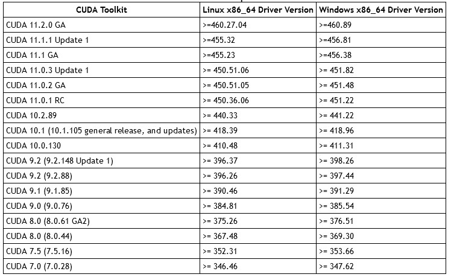

​                                                    图1.1 CUDA和显卡驱动的适用关系对照表

为了安装顺利，需要退出像360安全卫士这样的防护软件。

## 1.1 显卡驱动

### 1.1.1 选择版本

电脑桌面，右击，选择NVIDIA控制面板，

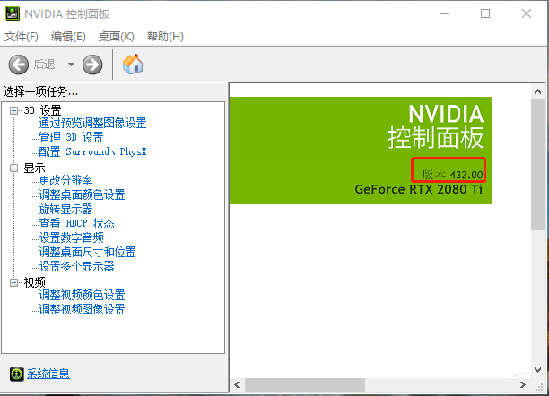

GPU显卡：GeForce RTX 280 TI；NVIDIA 显卡驱动：432.00

[驱动历史版本下载地址](https://www.nvidia.cn/Download/Find.aspx?lang=cn)

下载图示：

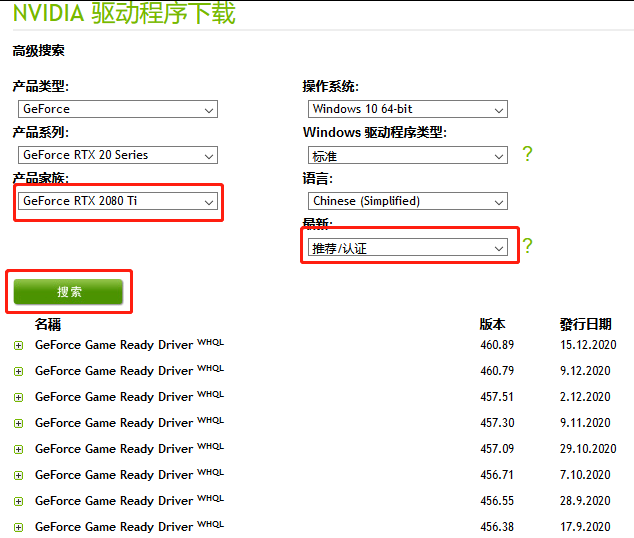

### 1.1.2 安装

选择合适版本，默认安装即可。安装完成后查看驱动版本进行确认。

## 1.2 CUDA工具包

### 1.2.1 选择版本

点击[网址](https://developer.nvidia.com/cuda-toolkit-archive)，选择适合的CUDA下载

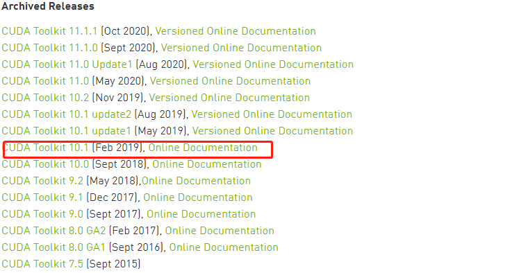

### 1.2.2 自定义安装

默认的安装路径，不要更改，保存即可。

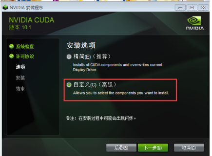

注意选择自定义安装，按照下图取消某些默认的选择，点击下一步即可。


### 1.2.3 添加环境变量

CUDA_INSTALL_PATH就是刚才保存的cuda的安装路径。

+ <CUDA_INSTALL_PATH>\NVIDIA GPU Computing Toolkit\CUDA\v10.1\bin
+ l<CUDA_INSTALL_PATH>\NVIDIA GPU Computing Toolkit\CUDA\v10.1\libnvvp
+ <CUDA_INSTALL_PATH>\NVIDIA GPU Computing Toolkit\CUDA\v10.1\extras\CUPTI\libx64
+ <CUDA_INSTALL_PATH>\NVIDIA GPU Computing Toolkit\CUDA\v10.1\lib\x64

示图：


+ <CUDA_INSTALL_PATH>\NVIDIA Corporation\NVSMI


+ <CUDA_INSTALL_PATH>\NVIDIA GPU Computing Toolkit\CUDA\v10.1

+ <CUDA_INSTALL_PATH>\NVIDIA Corporation\CUDA Samples\v10.1


### 1.2.4 验证安装

打开cmd，运行**nvidia-smi**,


------

## 1.3 cuDNN

### 1.3.1 选择版本

[cuDNN 和CUDA的对应关系](https://developer.nvidia.com/rdp/cudnn-archive#a-collapse742-10)


注册完成后，下载即可。

### 1.3.2 移动文件

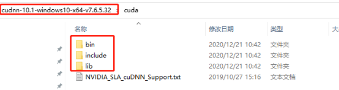

将三个文件中的文件(bin\cudnn64_7.dll，include\cudnn.h，lib\x64\cudnn.lib)，对应的移动到<CUDA_INSTALL_PATH>\NVIDIA GPU Computing Toolkit\CUDA\v10.1对应的文件中。

------

## 1.4 安装Anaconda

### 1.4.1 下载

[下载网站](https://www.anaconda.com/products/individual)页面下方，选择适合系统的版本进行安装。安装的时候注意选中添加路径的方框。

### 1.4.2 验证安装

打开Anaconda prompt

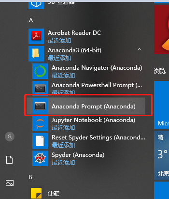

出现

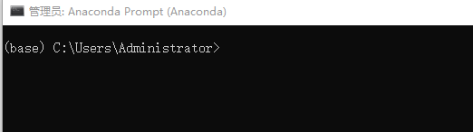

运行命令“**conda**”，显示

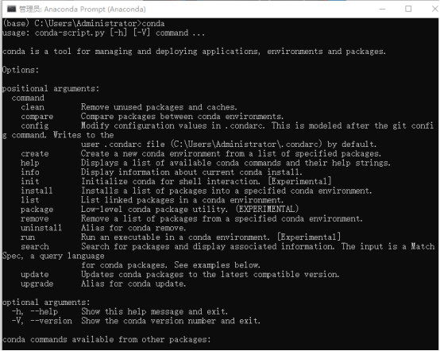

说明安装正确。

### 1.4.3 conda创建虚拟环境

运行命令“**conda create -n  虚拟环境名称  python=版本号**”

### 1.4.4 激活虚拟环境

运行命令“**activate 虚拟环境名称**”

------

## 1.5 运行方式

### 1.5.1 Jupyter Notebook

#### 1.5.1.1 建立python3.8虚拟环境

命令“conda create -n 虚拟环境名称 python=3.8”


验证安装完毕


#### 1.5.1.2 安装tensorflow-gpu 2.2.0 版本

在刚才的虚拟环境下，利用豆瓣源下载

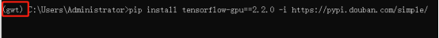


验证安装

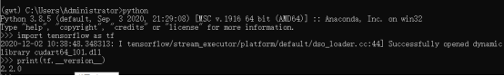

#### 1.5.1.3 安装ipython

退出激活的虚拟环境

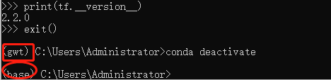

安装


#### 1.5.1.4 安装jupyter notebook

安装


#### 1.5.1.5 安装ipykernel


在上面建立的虚拟环境下创建kernel文件
“conda install -n gwt ipykernel”
激活虚拟环境
“activate gwt”
将虚拟环境写入Jupyter notebook的kernel里，并设置显示名称。
python -m ipykernel install --user --name gwt --display-name "GWT_OD"

#### 1.5.1.6 更改文件保存地址

Jupyter notebook文件默认保存的路径是C盘，可通过下面的方式更改。打开Anaconda Prompt后，首先运行盘符，进入相应的盘即可。


#### 1.5.1.7 验证安装

激活虚拟环境后，输入下面命令，会自动打开默认的浏览器。


选择上面设定的显示名称。


### 1.5.2 PyCharm

#### 1.5.2.1 下载免费社区版本

[下载网址](https://www.jetbrains.com/pycharm/download/other.html)，建议选择版本2019.3.5。

#### 1.5.2.2 设置编译器

File—setting

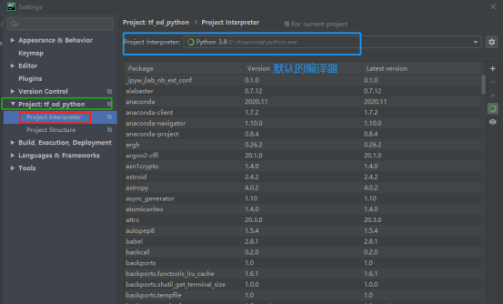

将这个编译器更改为前面虚拟环境中的编译器python.exe，编译器路径：Anaconda的安装路径\envs\虚拟环境名称，步骤如下。

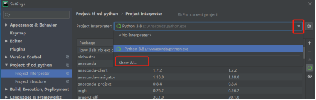


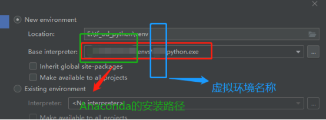

点击ok。

#### 1.5.2.3 验证

```python
import tensorflow as tf
import sys

sess = tf.compat.v1.Session(config=tf.compat.v1.ConfigProto(log_device_placement=True))
print('tensorflow版本', tf.__version__)
print('python版本', sys.version)
```

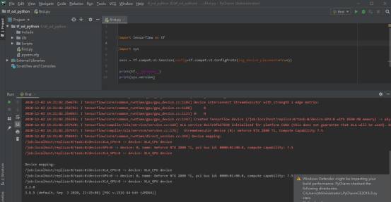

### 1.5.3 错误问题汇集

#### 1.5.3.1 出现.pywrap_tensorflow_internal import *错误

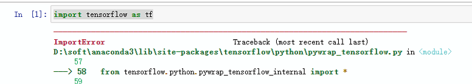

[选择](https://support.microsoft.com/en-us/help/2977003/the-latest-supported-visual-c-downloads)对应版本下载、安装即可。

