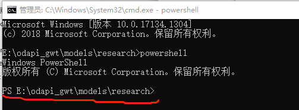
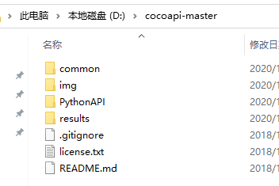

# 2 搭建Object Detection环境

## 2.1 安装TensorFlow模型库

1. 新建一个文件夹，本文示例为：odapi_gwt;

2. 下载包：

   1) 通过网址下载[https://github.com/tensorflow/models/archive/master.zip](https://github.com/tensorflow/models/archive/master.zip)，下载失败的话，多试几次即可；

   2) 通过git下载项目到本地，项目地址https://github.com/tensorflow/models；

3. 复制压缩包到刚才新建的文件夹，解压到当前文件夹，并重命名modes_master 变为models；

4. 新建的文件夹结构应该如下所示：

   

## 2.2 Protobuf安装与编译

Tensorflow目标检测API使用Protobufs来配置模型和训练参数。在使用框架之前，必须下载并编译Protobuf库。 

### 2.2.1 下载protoc

下载网址https://github.com/google/protobuf/releases，选择最新的python版本下载。

### 2.2.2 验证

将解压后bin文件中的protoc.exe复制到C:\Windows\System32下，打开cmd，运行protoc，不报错即可。

### 2.2.3 编译

此时打开 models\research\object_detection\protos，里面后缀全是.proto的文件，编译成功的话，每个.proto文件都会对应一个.py文件。否则编译失败。

打开E:\odapi_gwt\models\research，选中路径输入cmd，可快速进入该文件夹中

执行powershell

运行命令

==Get-ChildItem object_detection/protos/*.proto | Resolve-Path -Relative | %{ protoc $_ --python_out=. }==

运行完毕

查看models\research\object_detection\protos中文件的后缀即可。

## 2.3 安装COCO API

### 2.3.1 安装cython

激活虚拟环境，安装包cython。

### 2.3.2 下载coco api压缩包

项目地址：https://github.com/philferriere/cocoapi，下载

解压，

### 2.3.3 安装

安装前确定电脑里安装了Visual C++ 2015，下载地址，https://go.microsoft.com/fwlink/?LinkId=691126 )，默认安装即可。

cmd,激活虚拟环境，并打开解压的路径

运行命令

==python setup.py build_ext install==

如果出现下面错误：

Numpy版本问题，需要运行pip install numpy==1.9.3，再次执行命令即可。

验证安装，运行jupyter notebook,

## 2.4 安装Object Detection API

激活虚拟环境，运行命令，打开E:\odapi_gwt\models\research

然后运行命令

验证安装

如果出现错误

激活虚拟环境，安装即可

