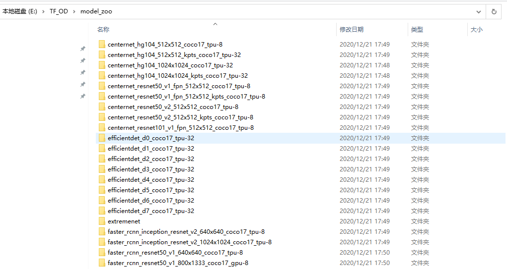

# 3 视频图片目标检测

## 3.1 模型下载

模型库官网：https://github.com/tensorflow/models/blob/master/research/object_detection/g3doc/tf2_detection_zoo.md

利用python程序将所有的模型下载到本地，并读取各种模型的精确度。

### 3.1.1 获取模型信息

获取模型信息python程序

```python
#!/usr/bin/env python
# author:AnFany
# datetime:2020/12/4 9:41


import requests       #导入requests包
from bs4 import BeautifulSoup
import re
import pandas as pd

# 从github获取链接，将所有模型下载到本地
Github_Address = r'https://github.com/tensorflow/models/blob/master/research/object_detection/g3doc/tf2_detection_zoo.md'
Headers = {"User-Agent":"Mozilla/5.0 (Windows NT 6.1; WOW64) AppleWebKit/537.36 (KHTML, like Gecko) "
                                  "Chrome/73.0.3683.86 Safari/537.36"}
strhtml = requests.get(Github_Address, headers=Headers)
# 获取表格
soup_table = BeautifulSoup(strhtml.text,'lxml').table

# tr标签内的数据
tr_set = soup_table.find_all("tr")

# 字典形式存储数据
Model_Dict = {}

Start_Sign = 0

for k in tr_set:
    if not Start_Sign:
        Start_Sign += 1
    else:
        uu = [ss for ss in k.get_text().split('\n') if ss]
        # 下载链接
        for gu in k.find_all('a'):
            link = gu['href']
        # 图片或者视频
        if '/' in uu[2]:
            fig_s, video_s = uu[2].split('/')
            Model_Dict[uu[0]] = {'速度': uu[1], '图片': fig_s, '视频': video_s}
        else:
            Model_Dict[uu[0]] = {'速度': uu[1], '图片': uu[2], '视频': 0}
        # 实现的功能
        for g in ['Boxes', 'Keypoints', 'Masks']:
            if g in uu[3]:
                Model_Dict[uu[0]][g] = 1
            else:
                Model_Dict[uu[0]][g] = 0
        Model_Dict[uu[0]]['地址'] = link

# 将字典形式转换
Dict_Model = {}
for l in Model_Dict:
    if '模型' not in Dict_Model:
        Dict_Model['模型'] = [l]
    else:
        Dict_Model['模型'].append(l)
    for kn in  Model_Dict[l]:
        if kn not in Dict_Model:
            Dict_Model[kn] = [Model_Dict[l][kn]]
        else:
            Dict_Model[kn].append(Model_Dict[l][kn])

# 写入文件
Model_Data = pd.DataFrame(Dict_Model)
Model_Data.to_csv('tfod_model_zoo.csv', index=False, encoding='gbk')
```

|                     模型                      | 速度(ms) | 图片(coco MAP) | 视频(coco MAP) | Boxes | Key Points | Masks | 下载                                                         |
| :-------------------------------------------: | -------: | -------------- | -------------- | ----- | ---------- | ----- | :----------------------------------------------------------- |
|        CenterNet HourGlass104 512x512         |       70 | 41.9           | 0              | 1     | 0          | 0     | [link](http://download.tensorflow.org/models/object_detection/tf2/20200713/centernet_hg104_512x512_coco17_tpu-8.tar.gz) |
|   CenterNet HourGlass104 Keypoints 512x512    |       76 | 40             | 61.4           | 1     | 1          | 0     | [link](http://download.tensorflow.org/models/object_detection/tf2/20200711/centernet_hg104_512x512_kpts_coco17_tpu-32.tar.gz) |
|       CenterNet HourGlass104 1024x1024        |      197 | 44.5           | 0              | 1     | 0          | 0     | [link](http://download.tensorflow.org/models/object_detection/tf2/20200713/centernet_hg104_1024x1024_coco17_tpu-32.tar.gz) |
|  CenterNet HourGlass104 Keypoints 1024x1024   |      211 | 42.8           | 64.5           | 1     | 1          | 0     | [link](http://download.tensorflow.org/models/object_detection/tf2/20200711/centernet_hg104_1024x1024_kpts_coco17_tpu-32.tar.gz) |
|       CenterNet Resnet50 V1 FPN 512x512       |       27 | 31.2           | 0              | 1     | 0          | 0     | [link](http://download.tensorflow.org/models/object_detection/tf2/20200711/centernet_resnet50_v1_fpn_512x512_coco17_tpu-8.tar.gz) |
|  CenterNet Resnet50 V1 FPN Keypoints 512x512  |       30 | 29.3           | 50.7           | 1     | 1          | 0     | [link](http://download.tensorflow.org/models/object_detection/tf2/20200711/centernet_resnet50_v1_fpn_512x512_kpts_coco17_tpu-8.tar.gz) |
|      CenterNet Resnet101 V1 FPN 512x512       |       34 | 34.2           | 0              | 1     | 0          | 0     | [link](http://download.tensorflow.org/models/object_detection/tf2/20200711/centernet_resnet101_v1_fpn_512x512_coco17_tpu-8.tar.gz) |
|         CenterNet Resnet50 V2 512x512         |       27 | 29.5           | 0              | 1     | 0          | 0     | [link](http://download.tensorflow.org/models/object_detection/tf2/20200711/centernet_resnet50_v2_512x512_coco17_tpu-8.tar.gz) |
|    CenterNet Resnet50 V2 Keypoints 512x512    |       30 | 27.6           | 48.2           | 1     | 1          | 0     | [link](http://download.tensorflow.org/models/object_detection/tf2/20200711/centernet_resnet50_v2_512x512_kpts_coco17_tpu-8.tar.gz) |
|            EfficientDet D0 512x512            |       39 | 33.6           | 0              | 1     | 0          | 0     | [link](http://download.tensorflow.org/models/object_detection/tf2/20200711/efficientdet_d0_coco17_tpu-32.tar.gz) |
|            EfficientDet D1 640x640            |       54 | 38.4           | 0              | 1     | 0          | 0     | [link](http://download.tensorflow.org/models/object_detection/tf2/20200711/efficientdet_d1_coco17_tpu-32.tar.gz) |
|            EfficientDet D2 768x768            |       67 | 41.8           | 0              | 1     | 0          | 0     | [link](http://download.tensorflow.org/models/object_detection/tf2/20200711/efficientdet_d2_coco17_tpu-32.tar.gz) |
|            EfficientDet D3 896x896            |       95 | 45.4           | 0              | 1     | 0          | 0     | [link](http://download.tensorflow.org/models/object_detection/tf2/20200711/efficientdet_d3_coco17_tpu-32.tar.gz) |
|           EfficientDet D4 1024x1024           |      133 | 48.5           | 0              | 1     | 0          | 0     | [link](http://download.tensorflow.org/models/object_detection/tf2/20200711/efficientdet_d4_coco17_tpu-32.tar.gz) |
|           EfficientDet D5 1280x1280           |      222 | 49.7           | 0              | 1     | 0          | 0     | [link](http://download.tensorflow.org/models/object_detection/tf2/20200711/efficientdet_d5_coco17_tpu-32.tar.gz) |
|           EfficientDet D6 1280x1280           |      268 | 50.5           | 0              | 1     | 0          | 0     | [link](http://download.tensorflow.org/models/object_detection/tf2/20200711/efficientdet_d6_coco17_tpu-32.tar.gz) |
|           EfficientDet D7 1536x1536           |      325 | 51.2           | 0              | 1     | 0          | 0     | [link](http://download.tensorflow.org/models/object_detection/tf2/20200711/efficientdet_d7_coco17_tpu-32.tar.gz) |
|           SSD MobileNet v2 320x320            |       19 | 20.2           | 0              | 1     | 0          | 0     | [link](http://download.tensorflow.org/models/object_detection/tf2/20200711/ssd_mobilenet_v2_320x320_coco17_tpu-8.tar.gz) |
|         SSD MobileNet V1 FPN 640x640          |       48 | 29.1           | 0              | 1     | 0          | 0     | [link](http://download.tensorflow.org/models/object_detection/tf2/20200711/ssd_mobilenet_v1_fpn_640x640_coco17_tpu-8.tar.gz) |
|       SSD MobileNet V2 FPNLite 320x320        |       22 | 22.2           | 0              | 1     | 0          | 0     | [link](http://download.tensorflow.org/models/object_detection/tf2/20200711/ssd_mobilenet_v2_fpnlite_320x320_coco17_tpu-8.tar.gz) |
|       SSD MobileNet V2 FPNLite 640x640        |       39 | 28.2           | 0              | 1     | 0          | 0     | [link](http://download.tensorflow.org/models/object_detection/tf2/20200711/ssd_mobilenet_v2_fpnlite_640x640_coco17_tpu-8.tar.gz) |
|   SSD ResNet50 V1 FPN 640x640 (RetinaNet50)   |       46 | 34.3           | 0              | 1     | 0          | 0     | [link](http://download.tensorflow.org/models/object_detection/tf2/20200711/ssd_resnet50_v1_fpn_640x640_coco17_tpu-8.tar.gz) |
|  SSD ResNet50 V1 FPN 1024x1024 (RetinaNet50)  |       87 | 38.3           | 0              | 1     | 0          | 0     | [link](http://download.tensorflow.org/models/object_detection/tf2/20200711/ssd_resnet50_v1_fpn_1024x1024_coco17_tpu-8.tar.gz) |
|  SSD ResNet101 V1 FPN 640x640 (RetinaNet101)  |       57 | 35.6           | 0              | 1     | 0          | 0     | [link](http://download.tensorflow.org/models/object_detection/tf2/20200711/ssd_resnet101_v1_fpn_640x640_coco17_tpu-8.tar.gz) |
| SSD ResNet101 V1 FPN 1024x1024 (RetinaNet101) |      104 | 39.5           | 0              | 1     | 0          | 0     | [link](http://download.tensorflow.org/models/object_detection/tf2/20200711/ssd_resnet101_v1_fpn_1024x1024_coco17_tpu-8.tar.gz) |
|  SSD ResNet152 V1 FPN 640x640 (RetinaNet152)  |       80 | 35.4           | 0              | 1     | 0          | 0     | [link](http://download.tensorflow.org/models/object_detection/tf2/20200711/ssd_resnet152_v1_fpn_640x640_coco17_tpu-8.tar.gz) |
| SSD ResNet152 V1 FPN 1024x1024 (RetinaNet152) |      111 | 39.6           | 0              | 1     | 0          | 0     | [link](http://download.tensorflow.org/models/object_detection/tf2/20200711/ssd_resnet152_v1_fpn_1024x1024_coco17_tpu-8.tar.gz) |
|       Faster R-CNN ResNet50 V1 640x640        |       53 | 29.3           | 0              | 1     | 0          | 0     | [link](http://download.tensorflow.org/models/object_detection/tf2/20200711/faster_rcnn_resnet50_v1_640x640_coco17_tpu-8.tar.gz) |
|      Faster R-CNN ResNet50 V1 1024x1024       |       65 | 31             | 0              | 1     | 0          | 0     | [link](http://download.tensorflow.org/models/object_detection/tf2/20200711/faster_rcnn_resnet50_v1_1024x1024_coco17_tpu-8.tar.gz) |
|       Faster R-CNN ResNet50 V1 800x1333       |       65 | 31.6           | 0              | 1     | 0          | 0     | [link](http://download.tensorflow.org/models/object_detection/tf2/20200711/faster_rcnn_resnet50_v1_800x1333_coco17_gpu-8.tar.gz) |
|       Faster R-CNN ResNet101 V1 640x640       |       55 | 31.8           | 0              | 1     | 0          | 0     | [link](http://download.tensorflow.org/models/object_detection/tf2/20200711/faster_rcnn_resnet101_v1_640x640_coco17_tpu-8.tar.gz) |
|      Faster R-CNN ResNet101 V1 1024x1024      |       72 | 37.1           | 0              | 1     | 0          | 0     | [link](http://download.tensorflow.org/models/object_detection/tf2/20200711/faster_rcnn_resnet101_v1_1024x1024_coco17_tpu-8.tar.gz) |
|      Faster R-CNN ResNet101 V1 800x1333       |       77 | 36.6           | 0              | 1     | 0          | 0     | [link](http://download.tensorflow.org/models/object_detection/tf2/20200711/faster_rcnn_resnet101_v1_800x1333_coco17_gpu-8.tar.gz) |
|       Faster R-CNN ResNet152 V1 640x640       |       64 | 32.4           | 0              | 1     | 0          | 0     | [link](http://download.tensorflow.org/models/object_detection/tf2/20200711/faster_rcnn_resnet152_v1_640x640_coco17_tpu-8.tar.gz) |
|      Faster R-CNN ResNet152 V1 1024x1024      |       85 | 37.6           | 0              | 1     | 0          | 0     | [link](http://download.tensorflow.org/models/object_detection/tf2/20200711/faster_rcnn_resnet152_v1_1024x1024_coco17_tpu-8.tar.gz) |
|      Faster R-CNN ResNet152 V1 800x1333       |      101 | 37.4           | 0              | 1     | 0          | 0     | [link](http://download.tensorflow.org/models/object_detection/tf2/20200711/faster_rcnn_resnet152_v1_800x1333_coco17_gpu-8.tar.gz) |
|   Faster R-CNN Inception ResNet V2 640x640    |      206 | 37.7           | 0              | 1     | 0          | 0     | [link](http://download.tensorflow.org/models/object_detection/tf2/20200711/faster_rcnn_inception_resnet_v2_640x640_coco17_tpu-8.tar.gz) |
|  Faster R-CNN Inception ResNet V2 1024x1024   |      236 | 38.7           | 0              | 1     | 0          | 0     | [link](http://download.tensorflow.org/models/object_detection/tf2/20200711/faster_rcnn_inception_resnet_v2_1024x1024_coco17_tpu-8.tar.gz) |
|   Mask R-CNN Inception ResNet V2 1024x1024    |      301 | 39             | 34.6           | 1     | 0          | 1     | [link](http://download.tensorflow.org/models/object_detection/tf2/20200711/mask_rcnn_inception_resnet_v2_1024x1024_coco17_gpu-8.tar.gz) |
|                  ExtremeNet                   |       -- | --             | 0              | 1     | 0          | 0     | [link](http://download.tensorflow.org/models/object_detection/tf2/20200711/extremenet.tar.gz) |

### 3.1.2 下载模型

模型下载python程序

```python
#!/usr/bin/env python
# author:AnFany
# datetime:2020/12/4 11:34

import urllib.request
import os
import pandas as pd
# 下载模型到本地
import tarfile

LocalFolder = r'E:\TF_OD\model_zoo'

# 获得模型下载地址
def load_model(csv=r'E:\TF_OD\py_pycharm\tfod_model_zoo.csv', folder=LocalFolder):
    data = pd.read_csv(csv, encoding='gbk')
    for add in data['地址'].values:
        name = add.split('/')
        if name[-1] not in os.listdir(folder):
            print('模型%s Loading……' % name[-1])
            urllib.request.urlretrieve(add, folder + '\\%s' % name[-1])
    # 将模型解压到文件夹中
    file_list = os.listdir(folder)
    for file in file_list:
        if '.tar.gz' in file:
            print('模型%s解压缩………………' % file)
            try:
                t = tarfile.open(folder + '\\%s' % file)
                t.extractall(path=folder)
                t.close()
                print('完成')
            except Exception as e:
                print('Warning！！失败，模型%s没有下载完，请重新下载' % file)

    return print('模型下载完毕')

load_model()
```



## 3.2 图片目标检测

python程序

```python
#!/usr/bin/env python
# author:AnFany
# datetime:2020/12/4 13:18

# 利用下载到本地的模型实现图片的目标检测
import os
import tensorflow as tf
from object_detection.utils import label_map_util
from object_detection.utils import visualization_utils as viz_utils
import numpy as np
from PIL import Image


# 模型名称
Model_Path = r'E:\TF_OD\model_zoo\efficientdet_d2_coco17_tpu-32'
# 输入图片路径
In_Figure_Path = r'E:\TF_OD\IN_Figure'
# 输出图片路径
Out_Figure_Path = r'E:\TF_OD\Out_Figure'
# 标签文件
PATH_TO_LABELS = 'E:\TF_OD\py_pycharm\mscoco_label_map.pbtxt'


# 图片格式转为数组
def load_image_into_numpy_array(path):
    return np.array(Image.open(path))

def figure_object_detection(modelp=Model_Path, infigurep=In_Figure_Path, labelsp=PATH_TO_LABELS, outfigure=Out_Figure_Path):
    """
    实现图片的目标检测
    :param modelp: 模型路径
    :param infigurep: 输入图片的路径
    :param labelsp: 标签路径
    :param oj: 需要识别出的类别
    :return: 识别出的图片存放路径
    """
    # 获取识别物体的标签对应字典
    category_index = label_map_util.create_category_index_from_labelmap(labelsp, use_display_name=True)

    # 加载模型
    detect_fn = tf.saved_model.load(modelp + "/saved_model")

    # 图片转数组
    for f in os.listdir(infigurep):
        image_np = load_image_into_numpy_array(r'%s/%s' %(infigurep, f))
        input_tensor = tf.convert_to_tensor(image_np)
        input_tensor = input_tensor[tf.newaxis, ...]
        detections = detect_fn(input_tensor)

        num_detections = int(detections.pop('num_detections'))

        detections = {key: value[0, :num_detections].numpy() for key, value in detections.items()}
        detections['num_detections'] = num_detections
        detections['detection_classes'] = detections['detection_classes'].astype(np.int64)
        image_np_with_detections = image_np.copy()
        viz_utils.visualize_boxes_and_labels_on_image_array(
            image_np_with_detections,
            detections['detection_boxes'],
            detections['detection_classes'],
            detections['detection_scores'],
            category_index,
            use_normalized_coordinates=True,
            max_boxes_to_draw=200,
            min_score_thresh=.30,
            agnostic_mode=False)

        # 保存为图片
        image = Image.fromarray(image_np_with_detections, 'RGB')
        image.save(r'%s/%s' % (outfigure, f))

figure_object_detection()
```

## 3.3 视频目标检测

### 3.3.1 本地视频

实现思路：将视频分成帧进行目标检测，然后在组合成视频。

python程序

```python
#!/usr/bin/env python
# author:AnFany
# datetime:2020/12/11 16:03

# 实现本地视频的目标检测
import cv2
import os
import tensorflow as tf
from object_detection.utils import label_map_util
from object_detection.utils import visualization_utils as viz_utils
import numpy as np
from PIL import Image


VideoInPath = r'E:\odapi_gwt\models\workspace\training_demo_RiverFloatage\river_video_floatage\Video_2020-11-30_161247.wmv'
VideoOutPath = r'E:\odapi_gwt\models\workspace\training_demo_RiverFloatage\river_video_floatage\test_RF.mp4'
Figpath = r'E:\odapi_gwt\models\workspace\training_demo_RiverFloatage\river_video_floatage\test_fig'
TimeInt = 1 # 间隔一帧保存一张图片
FPs = 40

# 模型名称
Model_Path = r'E:\odapi_gwt\models\workspace\training_demo_RiverFloatage\exported-models\RiverFloatage_Model'
# 标签文件
PATH_TO_LABELS = r'E:\odapi_gwt\models\workspace\training_demo_RiverFloatage\annotations\river_floatage.pbtxt'


"""
# 第一部分：视频拆成帧
"""
def video2figure(videos_path=VideoInPath, figure_path=Figpath, time_interval=TimeInt):
    fig_list = []
    vidcap = cv2.VideoCapture(videos_path)
    success, image = vidcap.read()
    count = 0
    while success:
        success, image = vidcap.read()
        if count % time_interval == 0:
            if image is None:
                break
            cv2.imencode('.jpg', image)[1].tofile('%s/fig_%d.jpg' % (figure_path, count))
            fig_list.append('fig_%d.jpg' % count)
        count += 1
    print('视频转换为图片')
    return fig_list

"""
# 第二部分：目标检测图片
"""

# 图片格式转为数组
def load_image_into_numpy_array(path):
    return np.array(Image.open(path))

def figure_object_detection(modelp=Model_Path, infigurep=video2figure(), labelsp=PATH_TO_LABELS, outfigure=Figpath):
    """
    实现图片的目标检测
    :param modelp: 模型路径
    :param infigurep: 输入图片的路径
    :param labelsp: 标签路径
    :param oj: 需要识别出的类别
    :return: 识别出的图片存放路径
    """
    # 获取识别物体的标签对应字典
    category_index = label_map_util.create_category_index_from_labelmap(labelsp, use_display_name=True)

    # 加载模型
    detect_fn = tf.saved_model.load(modelp + "/saved_model")

    # 检测后的图片列表
    object_fig_list = []

    # 图片转数组
    for f in infigurep:
        image_np = load_image_into_numpy_array(r'%s/%s' %(outfigure, f))
        input_tensor = tf.convert_to_tensor(image_np)
        input_tensor = input_tensor[tf.newaxis, ...]
        detections = detect_fn(input_tensor)
        num_detections = int(detections.pop('num_detections'))
        detections = {key: value[0, :num_detections].numpy() for key, value in detections.items()}
        detections['num_detections'] = num_detections
        detections['detection_classes'] = detections['detection_classes'].astype(np.int64)
        image_np_with_detections = image_np.copy()
        viz_utils.visualize_boxes_and_labels_on_image_array(
            image_np_with_detections,
            detections['detection_boxes'],
            detections['detection_classes'],
            detections['detection_scores'],
            category_index,
            use_normalized_coordinates=True,
            max_boxes_to_draw=3,
            min_score_thresh=0.2,
            agnostic_mode=False)
        # 保存为图片
        image = Image.fromarray(image_np_with_detections, 'RGB')
        image.save(r'%s/od_%s' % (outfigure, f))
        object_fig_list.append(r'%s/od_%s' % (outfigure, f))
    print('检测完毕')
    return object_fig_list

"""
# 第三部分：图片连成视频
"""
def figure2video(figlist=figure_object_detection(), outpath=VideoOutPath, fps=FPs):
    img = Image.open(figlist[0])
    img_size = img.size  # 获得图片分辨率，im_dir文件夹下的图片分辨率需要一致

    fourcc = cv2.VideoWriter_fourcc(*'mp4v')
    videoWriter = cv2.VideoWriter(outpath, fourcc, fps, img_size)

    for i in figlist:
        frame = cv2.imdecode(np.fromfile(i, dtype=np.uint8), -1)
        videoWriter.write(frame)
    videoWriter.release()
    return print('视频完毕')


figure2video()
```

### 3.3.2 在线视频

实现思路：利用OpenCV实现。python程序

```python
#!/usr/bin/env python
# author:AnFany
# datetime:2020/12/11 16:00

# 实现实时视频的目标检测

import cv2
import os
import tensorflow as tf
from object_detection.utils import label_map_util
from object_detection.utils import visualization_utils as viz_utils
import numpy as np
from PIL import Image


# 模型名称
Model_Path = r'E:\odapi_gwt\models\workspace\training_demo_james_kobe\exported-models\Lebron_Kobe_Model'
# 标签文件
PATH_TO_LABELS = r'E:\odapi_gwt\models\workspace\training_demo_james_kobe\annotations\label_map.pbtxt'

# 实时视频的输入文件
CAPVideo = cv2.VideoCapture(0, cv2.CAP_DSHOW)


def real_time_object_detection(modelp=Model_Path, labelsp=PATH_TO_LABELS, cap=CAPVideo):
    # 获取识别物体的标签对应字典
    category_index = label_map_util.create_category_index_from_labelmap(labelsp, use_display_name=True)
    # 加载模型
    detect_fn = tf.saved_model.load(modelp + "/saved_model")

    while 1:
        ret, image_np = cap.read()
        print(image_np)
        input_tensor = tf.convert_to_tensor(image_np)
        input_tensor = input_tensor[tf.newaxis, ...]
        detections = detect_fn(input_tensor)
        num_detections = int(detections.pop('num_detections'))
        detections = {key: value[0, :num_detections].numpy() for key, value in detections.items()}
        detections['num_detections'] = num_detections
        detections['detection_classes'] = detections['detection_classes'].astype(np.int64)
        image_np_with_detections = image_np.copy()
        viz_utils.visualize_boxes_and_labels_on_image_array(
            image_np_with_detections,
            detections['detection_boxes'],
            detections['detection_classes'],
            detections['detection_scores'],
            category_index,
            use_normalized_coordinates=True,
            max_boxes_to_draw=3,
            min_score_thresh=0.2,
            agnostic_mode=False)
        #
        cv2.imshow('object detection', image_np_with_detections)
        if cv2.waitKey(25) & 0xFF == ord('q'):
            cv2.destroyAllWindows()
            break
    cap.release()
    cv2.destroyAllWindows()


real_time_object_detection()
```


