# 4 训练目标检测模型

## 4.1 文件结构搭建

当前的文件夹结构应该是这样的：

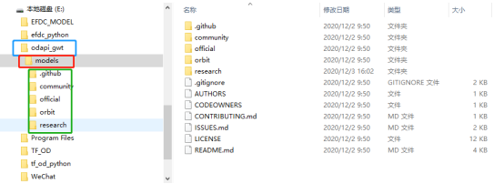

下面需要将文件的树结构变为如下样式：

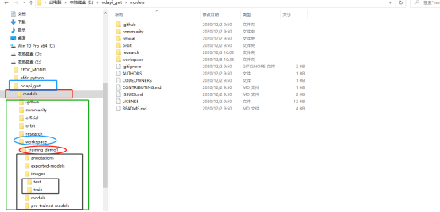

首先在目录下新建一个名为“workspace”的文件夹，该文件夹下面可以新建多个针对不同训练数据集的训练任务，例如training_demo1，training_demo3。

下面给出各个文件夹的说明：

+ **annotations**：存储\*.csv和\*.record格式的数据集的标注文件；

+ **exported-models**：存储模型的保存文件；

+ **Images**：存储数据集的图片以及标注后的\*.xml文件：
  + *Train*：训练数据集的图片以及对应的\*.xml文件；
  + *Test*：测试数据集的图片以及对应的\*.xml文件；

* **models**：这个文件夹将包含每个训练任务的子文件夹。每个子文件夹将包含训练管道配置文件\*.config，以及在训练和评估模型期间生成的所有文件。
* **pre-trained-models**：这个文件夹将包含下载的预训练模型，这些模型将作为我们训练工作的起始检查点。

实现建立文件结构的python程序

```python
#!/usr/bin/env python
# author:AnFany
# datetime:2020/12/14 16:12

# 建立文件夹框架

MainFolder = r'E:\odapi_gwt\models\workspace\training_demo_RiverFloatage'

FolderDict = {'annotations': 1,
              'exported-models': 1,
              'images': ['test', 'train'],
              'models':1,
              'pre-trained-models': 1}

import os

def build_folder(mp=MainFolder, fd=FolderDict):
    for dd in fd:
        alpath = '%s/%s' % (mp, dd)
        if os.path.exists(alpath):
            print('文件夹%s已经存在' % dd)
            pass
        else:
            if fd[dd] == 1:
                os.mkdir(alpath)
            else:
                for df in fd[dd]:
                    path = '%s/%s' % (alpath, df)
                    os.makedirs(path)
    return print('创建完毕')
build_folder()
```

## 4.2 准备数据集

### 4.2.1 数据标注

#### 4.2.1.1 安装LabelImg

pip方式安装(建议)，激活虚拟环境，执行命令

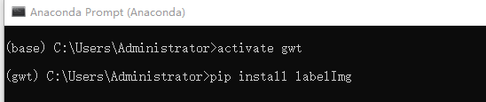

激活环境，cd进入图片存放的路径，然后运行labelImg即可。

#### 4.2.1.2 爬取百度图片

根据关键词爬取百度图片，可自定义数量。python程序

```python
#!/usr/bin/env python
# author:AnFany
# datetime:2020/12/8 15:31

# 根据名字利用百度图片爬取照片
import re
import os
import requests       #导入requests包
from bs4 import BeautifulSoup

# 保存图片的路径
FigPath = r'E:\odapi_gwt\models\workspace\training_demo_james_kobe\images'

HeadUrl = r'https://image.baidu.com/search/acjson?tn=resultjson_com' \
          r'&logid=8408718041848823114&ipn=rj&ct=201326592&is=&' \
          r'fp=result&queryWord={}&cl=2&lm=-1&ie=utf-8&oe=utf-8' \
          r'&adpicid=&st=-1&z=&ic=0&hd=&latest=&copyright=&word={}'\
          r'&s=&se=&tab=&width=&height=&face=0&istype=2&qc=&nc=1&' \
          r'fr=&expermode=&force=&pn={}&rn=30&gsm=1e&1607477042497='

Headers = {'User-Agent': 'Mozilla/5.0 (Windows NT 10.0; Win64; x64; rv:83.0) Gecko/20100101 Firefox/83.0'}

# 百度图片网址对应解码
StrTable = {'_z2C$q': ':', '_z&e3B': '.', 'AzdH3F': '/'}
CharTable = {'w': 'a', 'k': 'b', 'v': 'c', '1': 'd', 'j': 'e', 'u': 'f', '2': 'g', 'i': 'h', 't': 'i',
             '3': 'j', 'h': 'k', 's': 'l', '4': 'm', 'g': 'n', '5': 'o', 'r': 'p', 'q': 'q', '6': 'r',
             'f': 's', 'p': 't', '7': 'u', 'e': 'v', 'o': 'w', '8': '1', 'd': '2', 'n': '3', '9': '4',
             'c': '5', 'm': '6', '0': '7', 'b': '8', 'l': '9', 'a': '0'}

def get_keywords_star(keywords, count, name, hu=HeadUrl, h=Headers, fp=FigPath):
    fig_count = 0
    thirty_count = 1
    # 已经下载列表
    all_load = {}
    while fig_count < count:
        all_url = hu.format(keywords, keywords, thirty_count * 30)
        strhtml = requests.get(all_url, headers=h, timeout=100)
        # 获取网页源码
        soup_txt = BeautifulSoup(strhtml.text, 'lxml').text
        # 查找
        pattern_pic =  r'"objURL":"(.*?)"'
        # 获得所有url
        pic_list = re.findall(pattern_pic, soup_txt)
        # url转码函数
        def trans_url(exstr, s=StrTable, c=CharTable):
            for ks in s:
                if ks in exstr:
                    exstr = exstr.replace(ks, s[ks])
            new_url = ''
            for ke in exstr:
                if ke in c:
                    new_url += c[ke]
                else:
                    new_url += ke
            return new_url
        for kk in pic_list:
            real_url = trans_url(kk)
            prex = real_url.split('.')[-1]
            if  prex in ['jpg', 'jpeg', 'png']:
                if real_url not in all_load:
                    all_load[real_url] = 0
                    # 下载图片
                    try:
                        load_fig = requests.get(real_url)
                        figure_str = load_fig.content
                        if len(figure_str) > 40000:
                            # 保存图片
                            with open(r'%s/%s_%s.%s' % (fp, name, fig_count, prex), 'wb') as fogs:
                                fogs.write(load_fig.content)
                                fig_count += 1
                                print('{}已经下载完成{}张'.format(keywords, fig_count))
                                if fig_count == count:
                                    break
                    except:
                        pass

        thirty_count += 1

get_keywords_star('詹姆斯', 70, 'LeBron')
get_keywords_star('科比', 70, 'Kobe')
```

#### 4.2.1.3 图片标注

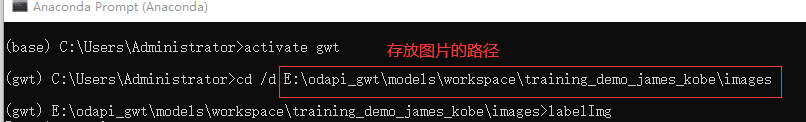

运行出现界面，

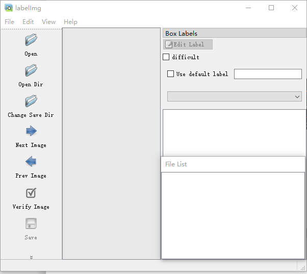

Open Dir 打开存放图片的路径，文件列表显示

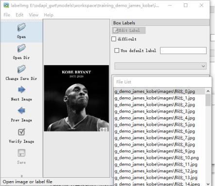

开始进行标注，选择图片右击，选择Create RectBox，鼠标出现十字框，划出类别的对角线，写入标签即可。保存后，每个图片文件都对应一个.xml格式的问文件。

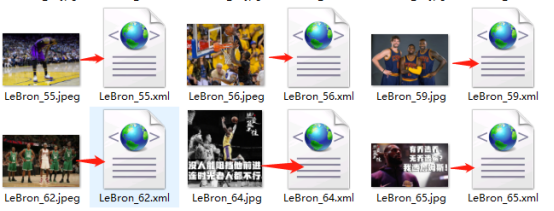

### 4.2.2 数据集分割

按照一定比例，将图片和对应的.xml文件，分别剪切到train、test文件夹中。

python程序

```python
#!/usr/bin/env python
# author:AnFany
# datetime:2020/12/9 14:52

# 根据比例，将图片以及标注的xml文件进行分割
# 该程序适合图片名称为类别_数字，后缀 为.jpg,jpeg,png的

import os
import numpy as np
import shutil

# 分割数据集，并移动到相应的文件夹
def split_figure_daaset(filepath=r'E:\odapi_gwt\models\workspace\training_demo_james_kobe\images', percent=0.2, anprex='xml'):
    class_figure = {}
    file_list = os.listdir(filepath)
    for f in file_list:
        if '.' in f:
            name, prex = f.split('.')
            c, n = name.split('_')
            # 键：类
            if c not in class_figure:
                class_figure[c] = {}
            # xml文件
            if prex == anprex:
                if anprex not in class_figure[c]:
                    class_figure[c][anprex] = [f]
                else:
                    class_figure[c][anprex].append(f)
            # 图片文件
            elif prex in ['jpg', 'jpeg', 'png']:
                if '%s.%s' % (name, anprex) in file_list:
                    if 'fig' not in class_figure[c]:
                        class_figure[c]['fig'] = [f]
                    else:
                        class_figure[c]['fig'].append(f)
    # 开始分割
    for dc in class_figure:
        length = len(class_figure[dc]['fig'])
        test_len = int(length * percent)
        # 随机选择几个
        all_sign = np.arange(length)
        test_sign = np.random.choice(all_sign, test_len, replace=False)
        test_file = list(np.array(class_figure[dc]['fig'])[test_sign]) + \
                    list(np.array(class_figure[dc]['xml'])[test_sign])

        train_sign = [hj for hj in all_sign if hj not in test_sign]
        train_file = list(np.array(class_figure[dc]['fig'])[train_sign]) + \
                    list(np.array(class_figure[dc]['xml'])[train_sign])

        # 开始移动测试文件
        for tfile in test_file:
            shutil.move('%s/%s' % (filepath, tfile), '%s/test' % filepath)

        # 开始移动训练文件
        for tfile in train_file:
            shutil.move('%s/%s' % (filepath, tfile), '%s/train' % filepath)

    return '数据集分割完毕'

print(split_figure_daaset())
```

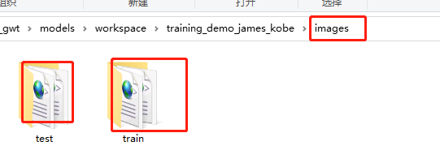

### 4.2.3 创建标签映射

根据数据集中的类别，创建形如下面格式的映射文件，放在文件夹annotations中。并将该文件的后缀名定义为.pbtxt，名称不限制，示图，注意类别之间不要留有空格。

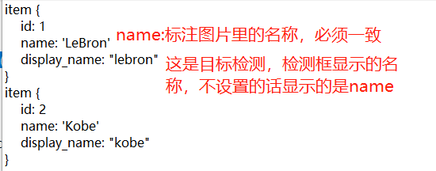

### 4.2.4 转\*.xml为\*.record格式

python程序

```python
#!/usr/bin/env python
# author:AnFany
# datetime:2020/12/9 16:16

# 将.xml格式转化为tfrecord格式的数据文件

import os
import glob
import pandas as pd
import io
import xml.etree.ElementTree as ET
os.environ['TF_CPP_MIN_LOG_LEVEL'] = '2'    # Suppress TensorFlow logging (1)
import tensorflow.compat.v1 as tf
from PIL import Image
from object_detection.utils import dataset_util, label_map_util
from collections import namedtuple

# .pbtxt文件路劲
PathPbtxt = r'E:\odapi_gwt\models\workspace\training_demo_RiverFloatage\annotations\river_floatage.pbtxt'

def xml_to_df(pxf, ppb=PathPbtxt):
    # 根据pbtxt文件，将字符串的类别变为数字类别
    label_map = label_map_util.load_labelmap(ppb)
    label_map_dict = label_map_util.get_label_map_dict(label_map)

    # 遍历.xml文件，将文件中的内容合并成pandas的DataFrame格式
    xml_list = []
    for subfile in os.listdir(pxf):
        name, prex = subfile.split('.')
        if prex == 'xml':
            # 解析XML文件
            tree = ET.parse('%s/%s' % (pxf, subfile))
            root = tree.getroot()
            for member in root.findall('object'):
                value = (root.find('filename').text,  #对应的图片
                         int(root.find('size')[0].text),  # 图片的宽度
                         int(root.find('size')[1].text),  # 图片的高度
                         member[0].text,  # 类别
                         int(member[4][0].text),          # x最小
                         int(member[4][1].text),          # y最小
                         int(member[4][2].text),          # x最大
                         int(member[4][3].text)           # y最大
                         )
                xml_list.append(value)
        column_name = ['filename', 'width', 'height', 'class', 'xmin', 'ymin', 'xmax', 'ymax']
        xml_df = pd.DataFrame(xml_list, columns=column_name)

    return xml_df, label_map_dict

# df格式数据分组
def split(df, group):
    data = namedtuple('data', ['filename', 'object'])
    gb = df.groupby(group)
    return [data(filename, gb.get_group(x)) for filename, x in zip(gb.groups.keys(), gb.groups)]

# 创建example
def create_tf_example(group, ld, path):
    with tf.gfile.GFile(os.path.join(path, '{}'.format(group.filename)), 'rb') as fid:
        encoded_jpg = fid.read()
    encoded_jpg_io = io.BytesIO(encoded_jpg)
    image = Image.open(encoded_jpg_io)
    width, height = image.size

    filename = group.filename.encode('utf8')
    image_format = b'jpg'
    xmins = []
    xmaxs = []
    ymins = []
    ymaxs = []
    classes_text = []
    classes = []

    for index, row in group.object.iterrows():
        xmins.append(row['xmin'] / width)
        xmaxs.append(row['xmax'] / width)
        ymins.append(row['ymin'] / height)
        ymaxs.append(row['ymax'] / height)
        classes_text.append(row['class'].encode('utf8'))
        classes.append(ld[row['class']])

    tf_example = tf.train.Example(features=tf.train.Features(feature={
        'image/height': dataset_util.int64_feature(height),
        'image/width': dataset_util.int64_feature(width),
        'image/filename': dataset_util.bytes_feature(filename),
        'image/source_id': dataset_util.bytes_feature(filename),
        'image/encoded': dataset_util.bytes_feature(encoded_jpg),
        'image/format': dataset_util.bytes_feature(image_format),
        'image/object/bbox/xmin': dataset_util.float_list_feature(xmins),
        'image/object/bbox/xmax': dataset_util.float_list_feature(xmaxs),
        'image/object/bbox/ymin': dataset_util.float_list_feature(ymins),
        'image/object/bbox/ymax': dataset_util.float_list_feature(ymaxs),
        'image/object/class/text': dataset_util.bytes_list_feature(classes_text),
        'image/object/class/label': dataset_util.int64_list_feature(classes),
    }))
    return tf_example

def xml_to_record(pxf, pre):
    writer = tf.python_io.TFRecordWriter(pre)
    xml_df, label_map_dict = xml_to_df(pxf)
    grouped = split(xml_df, 'filename')
    for group in grouped:
        tf_example = create_tf_example(group, label_map_dict, pxf)
        writer.write(tf_example.SerializeToString())
    writer.close()
    print('转化完成')

# .xml存储的路径\图片路径
PathXmlFig = r'E:\odapi_gwt\models\workspace\training_demo_RiverFloatage\images'
# .record输出的路径
PathRecord = r'E:\odapi_gwt\models\workspace\training_demo_RiverFloatage\annotations'

# 训练文件和测试文件
xml_to_record(os.path.join(PathXmlFig, 'test'), os.path.join(PathRecord, 'test.record'))
xml_to_record(os.path.join(PathXmlFig, 'train'), os.path.join(PathRecord, 'train.record'))
```

程序和\*.xml文件对应说明：

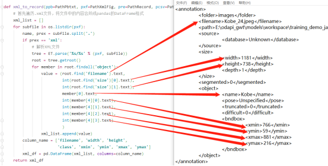

运行完毕后

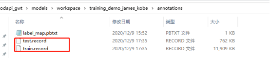

## 4.3 构建训练任务

### 4.3.1 获取预训练模型

使用预训练模型进行训练，将前面下载好的模型文件夹复制到pre-trained-models文件夹内，结构和上图类似。可以将多个模型按照同样方式复制过来。

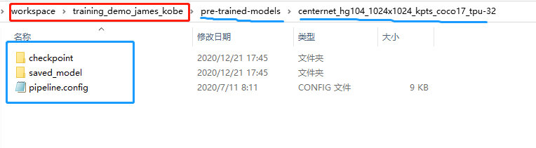

### 4.3.2 配置训练管道

在models文件夹下面新建一个自定义文件夹，将要用的预训练模型中的pipeline.config文件复制到该文件夹下面，

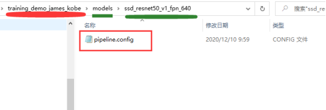

下面对该配置文件进行修改，其中关于路径的设置都设置为E:\odapi_gwt\models\workspace\training_demo_james_kobe的相对路径。

#### 4.3.2.1 设置检测对象类

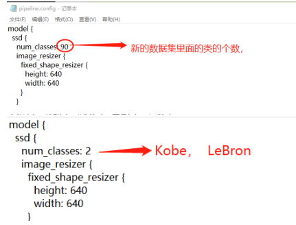

#### 4.3.2.2 设置批训练大小

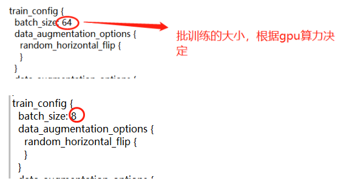

#### 4.3.2.3 模型配置


#### 4.3.2.4 训练数据集

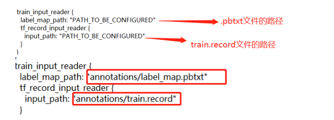

#### 4.3.2.5 测试数据集

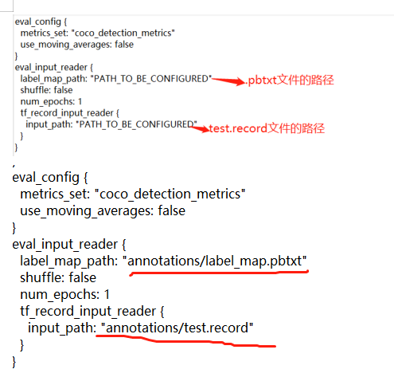

### 4.3.3 训练模型

将/models/research/object_detection/model_main_tf2.py文件，复制到training_demo_james_kobe文件夹内。

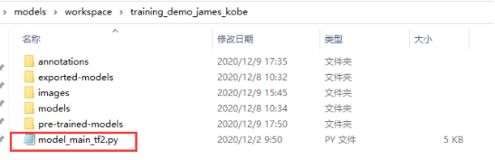

激活虚拟环境，打开training_demo_james_kobe，运行命令

==python model_main_tf2.py --model_dir=models/ssd_resnet50_v1_fpn_640 --pipeline_config_path=models/ssd_resnet50_v1_fpn_640/pipeline.config==

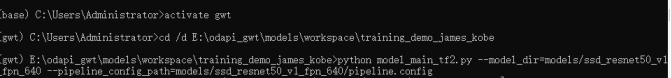

#### 4.3.3.1 No module named 'lvis'

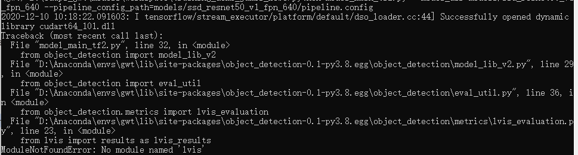

解决办法：激活虚拟环境，运行命令 ==pip install lvis==

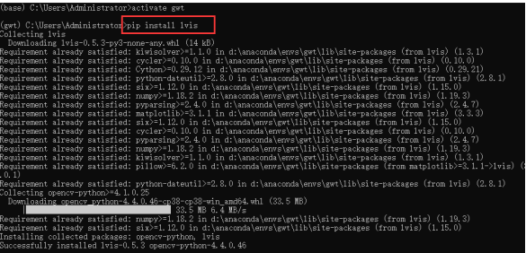


#### 4.3.3.2 No module named 'official'

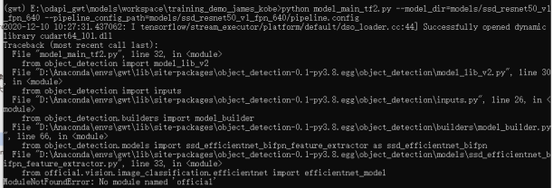

解决办法：将

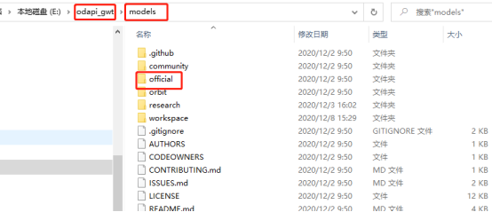

复制到

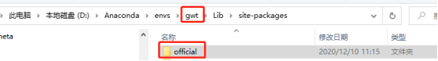

#### 4.3.3.3 No module named 'yaml'

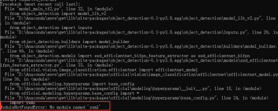

解决办法：激活虚拟环境，运行命令 ==pip install pyyaml==

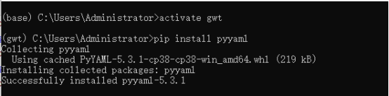

#### 4.3.3.4 开始训练

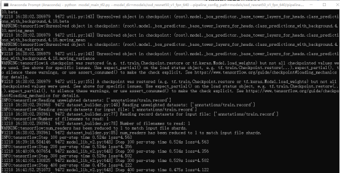

### 4.3.4 训练过程可视化

在打开Anaconda Prompt，激活虚拟环境，打开路径，执行==tensorboard --logdir=models/ssd_resnet50_v1_fpn_640==

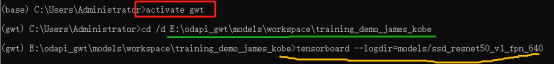

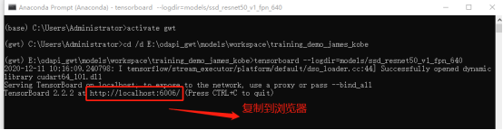

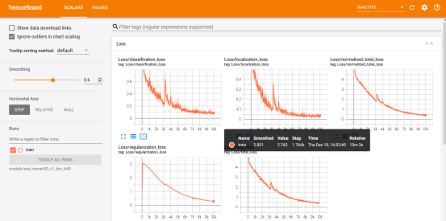

## 4.4 评估模型

三种评估标准，对应修改pipeline.config文件的178-179 行。

### 4.4.1 设置评估标准

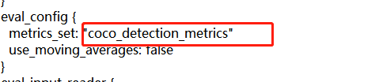


* PASCAL VOC 2010 detection metric

metrics_set='pascal_voc_detection_metrics'

* COCO detection metrics

metrics_set='coco_detection_metrics'

* Open Images V2 detection metric

metrics_set='oid_V2_detection_metrics'

### 4.4.2 评估

在打开Anaconda Prompt，激活虚拟环境，打开路径，执行

==python model_main_tf2.py --model_dir=models/ssd_resnet50_v1_fpn_640 --pipeline_config_path=models/ssd_resnet50_v1_fpn_640/pipeline.config --checkpoint_dir=models/ssd_resnet50_v1_fpn_640==

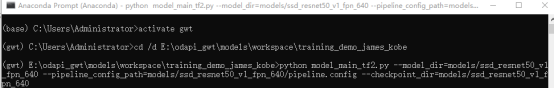

评估的是最新保存的模型

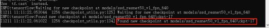

如果出现 'numpy.float64' object cannot be interpreted as an integer错误，

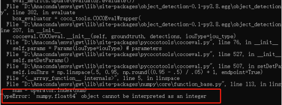

解决办法：找到报错的文件，需要修改507、508行

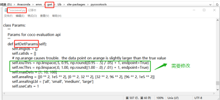

修改后：

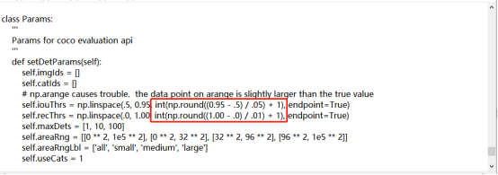

保存，再次运行即可。

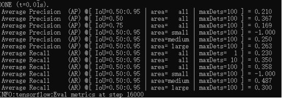

### 4.4.3 评估结果查看

评估结果保存在

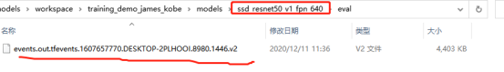

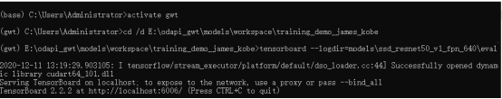

## 4.5 模型保存

 模型训练完毕后，将models/research/object_detection/exporter_main_v2.py文件复制到下面文件夹中。

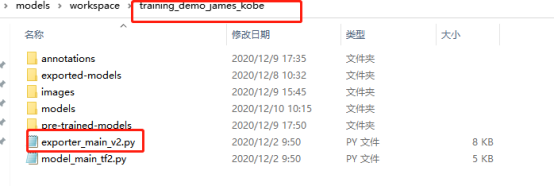

激活虚拟环境，cd打开路径E:\odapi_gwt\models\workspace\training_demo_james_kobe，执行下面的命令

==python exporter_main_v2.py --input_type image_tensor --pipeline_config_path models\ssd_resnet50_v1_fpn_640\pipeline.config --trained_checkpoint_dir models\ssd_resnet50_v1_fpn_640\ --output_directory exported-models\Lebron_Kobe_Model==

出现错误

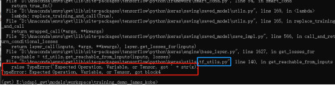

解决办法，修改蓝框中的文件的第140行，

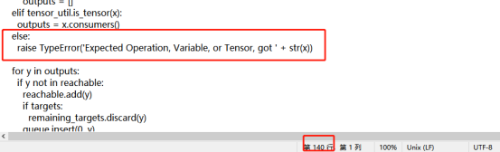

修改后，

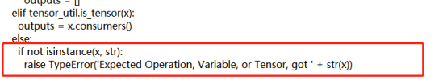

保存，再运行命令即可。

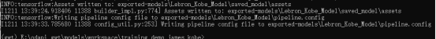

运行完成后的结果

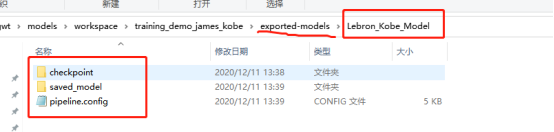

## 4.6 模型预测

利用保存的模型进行预测，python程序

```python
#!/usr/bin/env python
# author:AnFany
# datetime:2020/12/11 13:55

# 利用刚保存的模型进行图片的预测

import os
import tensorflow as tf
from object_detection.utils import label_map_util
from object_detection.utils import visualization_utils as viz_utils
import numpy as np
from PIL import Image

# 模型名称
Model_Path = r'E:\odapi_gwt\models\workspace\training_demo_james_kobe\exported-models\Lebron_Kobe_Model'
# 输入图片路径
In_Figure_Path = r'E:\TF_OD\IN_Figure'
# 输出图片路径
Out_Figure_Path = r'E:\TF_OD\Out_Figure'
# 标签文件
PATH_TO_LABELS = r'E:\odapi_gwt\models\workspace\training_demo_james_kobe\annotations\label_map.pbtxt'

# 图片格式转为数组
def load_image_into_numpy_array(path):
    return np.array(Image.open(path))

def figure_object_detection(modelp=Model_Path, infigurep=In_Figure_Path, labelsp=PATH_TO_LABELS, outfigure=Out_Figure_Path):
    """
    实现图片的目标检测
    :param modelp: 模型路径
    :param infigurep: 输入图片的路径
    :param labelsp: 标签路径
    :param oj: 需要识别出的类别
    :return: 识别出的图片存放路径
    """
    # 获取识别物体的标签对应字典
    category_index = label_map_util.create_category_index_from_labelmap(labelsp, use_display_name=True)

    # 加载模型
    detect_fn = tf.saved_model.load(modelp + "/saved_model")

    # 图片转数组
    for f in os.listdir(infigurep):
        image_np = load_image_into_numpy_array(r'%s/%s' %(infigurep, f))
        input_tensor = tf.convert_to_tensor(image_np)
        input_tensor = input_tensor[tf.newaxis, ...]
        detections = detect_fn(input_tensor)
        num_detections = int(detections.pop('num_detections'))
        detections = {key: value[0, :num_detections].numpy() for key, value in detections.items()}
        detections['num_detections'] = num_detections
        detections['detection_classes'] = detections['detection_classes'].astype(np.int64)
        image_np_with_detections = image_np.copy()
        viz_utils.visualize_boxes_and_labels_on_image_array(
            image_np_with_detections,
            detections['detection_boxes'],
            detections['detection_classes'],
            detections['detection_scores'],
            category_index,
            use_normalized_coordinates=True,
            max_boxes_to_draw=200,
            min_score_thresh=.30,
            agnostic_mode=False)
        # 保存为图片
        image = Image.fromarray(image_np_with_detections, 'RGB')
        image.save(r'%s/%s' % (outfigure, f))

figure_object_detection()
```


