# 5 人脸识别模型

实现方式：首先利用MTCNN实现图片中人脸的检测并进行对齐，再利用FaceNet将检测到的人脸和数据库存储的人脸进行比对，从而实现人脸识别。

本章实现人脸识别的具体流程：

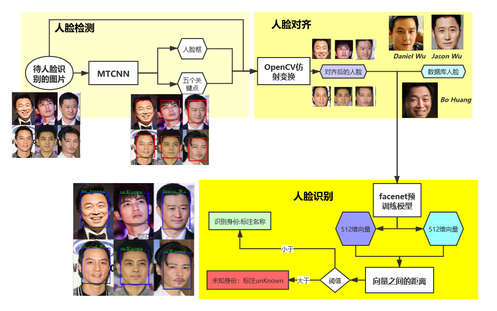

## 5.1 MTCNN

激活虚拟环境，运行pip install mtcnn。

### 5.1.1 人脸检测

下面是MTCNN针对检测到的一个人脸的输出。在输出人脸框坐标的同时，也会输出两只眼睛，鼻子和嘴巴的左、右五个关键点的像素坐标：

```python
{'box': [711, 205, 202, 180], 'confidence': 0.9637635946273804, 'keypoints': {'left_eye': (823, 274), 'right_eye': (834, 327), 'nose': (795, 300), 'mouth_left': (762, 293), 'mouth_right': (767, 337)}}
```

python程序

```python
#!/usr/bin/env python
# author:AnFany
# datetime:2020/12/24 17:40

# 利用mtcnn实现图片中人脸的检测

from mtcnn.mtcnn import MTCNN
import cv2
import os

# 输入图片路径
IN_Figure_Path = r'C:\Users\Administrator\Desktop\mtcnn_figure\mtcnn_in'

# 输出图片路径
OUT_Figure_Path = r'C:\Users\Administrator\Desktop\mtcnn_figure\mtcnn_out'

# 进行人脸检测的函数
def mtcnn_face_detection(inp=IN_Figure_Path, outp=OUT_Figure_Path, boxcolor=(220, 20, 20),
                         keypointcolor=(20, 220, 20),boxw=3):
    """
    :param inp: 需要进行人脸检测的图片的路径
    :param outp: 检测后的输出路径
    :param boxcolor: (255,0,0) 对应rgb，检测框的颜色
    :param keypointcolor: (255,0,0) 对应rgb，检测框的颜色
    :param boxw: 检测框的宽度
    :return: 带有检测框的图片
    """
    # 人脸检测模型
    detector = MTCNN()
    for fig in os.listdir(inp):
        # 因为cv2读取的图片数据是bgr的，模型的输入是rgb的
        img_data = cv2.cvtColor(cv2.imread(r'%s/%s' %(inp, fig)), cv2.COLOR_BGR2RGB)
        # 检测结果
        result_detection =  detector.detect_faces(img_data)
        # 判断是否检测出人脸
        if result_detection:
            for face in result_detection:
                # 获取框的像素坐标
                minx, miny, width, height = face['box']
                maxx, maxy = minx+width, miny + height
                # 加上人脸框
                face_data = cv2.rectangle(img_data, (minx, miny), (maxx, maxy), boxcolor, boxw)
                # 加上五关键点
                for k in ['left_eye', 'right_eye', 'nose', 'mouth_left', 'mouth_right']:
                    face_data = cv2.circle(face_data, face['keypoints'][k], radius=0,
                                           color=keypointcolor, thickness=boxw*2)
                # 数据通道在变回去
                face_data = cv2.cvtColor(face_data, cv2.COLOR_RGB2BGR)
            # 保存图片
            name = ''.join(fig.split('.')[:-1])
            cv2.imwrite(r'%s/%s.png' % (outp, name), face_data, [int(cv2.IMWRITE_JPEG_QUALITY), 100])
    return print('人脸检测完毕')

mtcnn_face_detection()
```

示图：


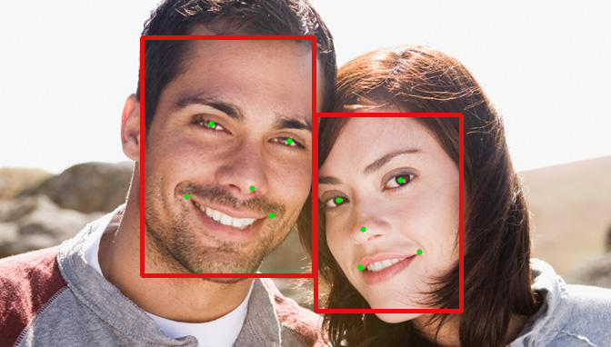

### 5.1.2 人脸对齐

激活虚拟环境，运行命令pip install scikit-image。需要根据五个关键点的像素坐标，以及标准正脸各个关键点的坐标计算仿射变换的矩阵，然后对图片进行裁剪，得到"正脸"。

python程序

```python
#!/usr/bin/env python
# author:AnFany
# datetime:2020/12/28 10:03

# 在人脸识别的基础上将输出的人脸进行对齐校正

from mtcnn.mtcnn import MTCNN
import cv2
import os
import numpy as np
from skimage import transform as trans


# 输入图片路径
IN_Figure_Path = r'C:\Users\Administrator\Desktop\mtcnn_figure\mtcnn_in'

# 输出图片路径
OUT_Figure_Path = r'C:\Users\Administrator\Desktop\mtcnn_figure\mtcnn_out'

# 正脸按照112*112的尺寸，此时左眼、右眼、鼻子、嘴巴左边、右边的坐标为
KeyPoints = np.array([(38.2946, 51.6963),
                      (73.5318, 51.6963),
                      (56.0252, 71.7366),
                      (41.5493, 92.3655),
                      (70.7299, 92.3655)])

# 进行人脸检测的函数
def mtcnn_face_detection_align(inp=IN_Figure_Path, outp=OUT_Figure_Path,
                               boxcolor=(220, 20, 20), boxw=3, dst_data=KeyPoints, figsize=(112, 112)):
    """
    :param inp: 需要进行人脸检测的图片的路径
    :param outp: 检测后的输出路径
    :param boxcolor: (220, 20, 20) 对应rgb，检测框的颜色
    :param boxw: 检测框的宽度
    :param dst_data: 112*112 的正脸中关键点的坐标
    :param figsize: 图片尺寸112*112
    :return: 人脸对齐后的图片
    """
    # 人脸检测模型
    detector = MTCNN()
    for fig in os.listdir(inp):
        # 因为cv2读取的图片数据是bgr的，模型的输入是rgb的
        img_data = cv2.cvtColor(cv2.imread(r'%s/%s' %(inp, fig)), cv2.COLOR_BGR2RGB)
        # 检测结果
        result_detection =  detector.detect_faces(img_data)
        # 判断是否检测出人脸
        name = ''.join(fig.split('.')[:-1])
        if result_detection:
            face_count = 1 # 人脸数量
            face_set = []
            for face in result_detection:
                # 获取框的像素坐标
                minx, miny, width, height = face['box']
                maxx, maxy = minx+width, miny + height
                # 保存人脸框
                face_set.append([[minx, miny], [maxx, maxy]])
                # 将检测到的人脸图片截取下来
                face_detection_data = img_data[miny:maxy,minx:maxx, :]
                face_detection_data = cv2.cvtColor(face_detection_data, cv2.COLOR_RGB2BGR)
                # 保存截取到的人脸
                cv2.imwrite(r'%s/%s_%s.png' % (outp, name, face_count), face_detection_data, [int(cv2.IMWRITE_JPEG_QUALITY), 100])

                # 获得五个关键点的坐标
                src_data = []
                for k in ['left_eye','right_eye','nose','mouth_left','mouth_right']:
                    src_data.append(face['keypoints'][k])

                # 计算放射矩阵
                tform = trans.SimilarityTransform()
                res = tform.estimate(np.array(src_data), dst_data)
                M = tform.params
                # 应用仿射矩阵进行人脸对齐
                align_face_data =  cv2.warpAffine(img_data.copy(), M[:2,:], figsize,
                                                  flags=cv2.INTER_CUBIC, borderValue=(255,255,255))
                align_face_data = cv2.cvtColor(align_face_data, cv2.COLOR_RGB2BGR)
                cv2.imwrite(r'%s/%s_%s_align.png' % (outp, name, face_count), align_face_data,
                            [int(cv2.IMWRITE_JPEG_QUALITY), 100])
                face_count += 1

            for fb in face_set:
                # 加上人脸框
                face_data = cv2.rectangle(img_data, tuple(fb[0]), tuple(fb[1]), boxcolor, boxw)
            # 数据通道在变回去
            face_data = cv2.cvtColor(face_data, cv2.COLOR_RGB2BGR)
            # 保存带有人脸框的图片
            cv2.imwrite(r'%s/%s.png' % (outp, name), face_data, [int(cv2.IMWRITE_JPEG_QUALITY), 100])

    return print('人脸检测完毕')

mtcnn_face_detection_align()
```

截取到的人脸


对齐后：


截取到的人脸


对齐后


## 5.2 FaceNet

### 5.2.1 下载FaceNet源码

新建一个文件夹，在该文件夹内点击Git Bash Here，运行 git clone [https://github.com/davidsandberg/facenet.git](https://github.com/davidsandberg/facenet.git)。

如果下载失败，可以多试试几次。

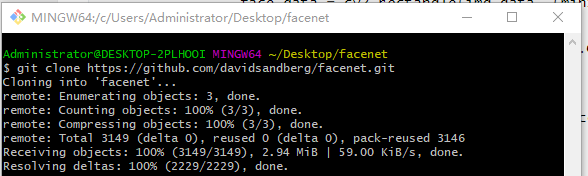


成功后，将新生成的文件夹facenet，

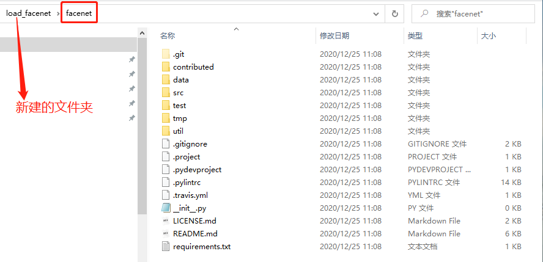

移动到虚拟环境安装的包的路径中：

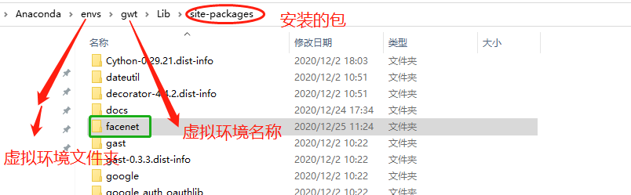

验证

```python

```

出现错误

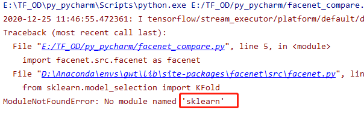

激活虚拟环境，运行pip install scikit-learn

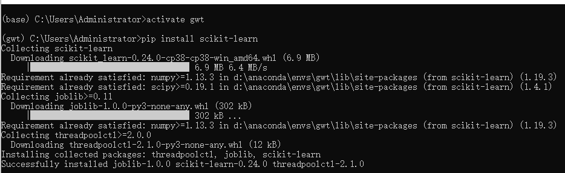


### 5.2.2 下载预训练模型

模型网址https://github.com/davidsandberg/facenet，

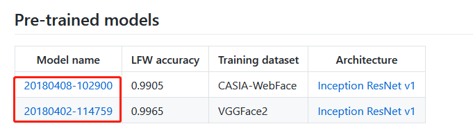

因为模型在谷歌云盘上，需要翻墙下载，下面给出两个模型的百度网盘下载地址：

+ 20180408-102900 

链接：https://pan.baidu.com/s/1fLKmJojLo8U8TLnREncxIw 
提取码：1whr 

+ 20180402-114759

链接：https://pan.baidu.com/s/1QbwbDnVHfbIPZgM3mVlhKA 
提取码：y7fr 

### 5.2.3 人脸数据库

将对齐后的图片输入到预训练模型中，获得模型输出的512维向量，在计算向量之间的相似度(欧式距离和余弦相似)。

#### 5.2.3.1 建立人脸数据库

收集需要识别的人的3-5张不同角度的图片，作为人脸数据库的原始图片。根据原始图片建立人脸图片数据。

python程序

```python
#!/usr/bin/env python
# author:AnFany
# datetime:2020/12/30 13:44


# 根据人脸数据库原始图片存储的每个人的照片，建立人脸图片数据
from mtcnn.mtcnn import MTCNN
import cv2
import os
import numpy as np
from skimage import transform as trans
import shutil

# 人脸数据库路径
DataBase_Figure_Path = r'E:\facenet_database'
# 存放每个人的原始图片文件夹
Origin_Name = 'origin_fig'

# 不同尺寸下人脸左眼、右眼、鼻子、左嘴角、右嘴角的坐标的对应关系
Size_KeyPoints = {'1': [(112, 112), np.array([(38.2946, 51.6963),
                                              (73.5318, 51.6963),
                                              (56.0252, 71.7366),
                                              (41.5493, 92.3655),
                                              (70.7299, 92.3655)])],
                  '2': [(96, 96), np.array([(30.2946, 43.6963),
                                            (65.5318, 43.6963),
                                            (48.0252, 63.7366),
                                            (33.5493, 84.3655),
                                            (62.7299, 84.3655)])]}

# 建立每个人的人脸图片
def build_face_person_database(inp=DataBase_Figure_Path, oname=Origin_Name, dst_data=Size_KeyPoints):
    # 首先建立人脸文件夹
    face_path = os.path.join(inp, 'face_fig')
    if 'face_fig' in os.listdir(inp):
        shutil.rmtree(face_path)
        os.mkdir(face_path)
    else:
        os.mkdir(face_path)

    # 人脸检测模型
    detector = MTCNN()

    # 开始遍历原始图片
    originfigpath = os.path.join(inp, oname)
    # 遍历每个人的文件夹
    for fol in os.listdir(originfigpath):
        # 新建文件夹
        new_face_path = os.path.join(face_path, fol)
        if not os.path.exists(new_face_path):
            os.mkdir(new_face_path)
        # 遍历每个图片
        person_file = os.path.join(originfigpath, fol)
        for per in os.listdir(person_file):
            fig_path = os.path.join(person_file, per)
            # 人脸检测模型
            # 因为cv2读取的图片数据是bgr的，模型的输入是rgb的
            img_data = cv2.cvtColor(cv2.imread(fig_path), cv2.COLOR_BGR2RGB)
            # 检测结果
            result_detection = detector.detect_faces(img_data)
            # 判断是否检测出人脸
            name = ''.join(per.split('.')[:-1])
            if result_detection:
                face_count = 1 # 人脸数量
                face_set = []
                for face in result_detection:
                    # 获取框的像素坐标
                    minx, miny, width, height = face['box']
                    maxx, maxy = minx+width, miny + height
                    # 保存人脸框
                    face_set.append([[minx, miny], [maxx, maxy]])
                    # 将检测到的人脸图片截取下来
                    face_detection_data = img_data[miny:maxy,minx:maxx, :]
                    face_detection_data = cv2.cvtColor(face_detection_data, cv2.COLOR_RGB2BGR)

                    # 获得五个关键点的坐标
                    src_data = []
                    for k in ['left_eye','right_eye','nose','mouth_left','mouth_right']:
                        src_data.append(face['keypoints'][k])

                    # 计算放射矩阵
                    tform = trans.SimilarityTransform()
                    # 遍历不同的正脸尺寸
                    for d in dst_data:
                        fsize, kdata = dst_data[d]
                        res = tform.estimate(np.array(src_data), kdata)
                        M = tform.params
                        # 应用仿射矩阵进行人脸对齐
                        align_face_data =  cv2.warpAffine(img_data.copy(), M[:2,:], fsize,
                                                          flags=cv2.INTER_CUBIC, borderValue=(255,255,255))
                        # 转化通道
                        align_face_data = cv2.cvtColor(align_face_data, cv2.COLOR_RGB2BGR)
                        # 保存图片
                        cv2.imwrite(r'%s/%s_%s_%s_%s.png' % (new_face_path, d, fol, face_count,name), align_face_data,
                                    [int(cv2.IMWRITE_JPEG_QUALITY), 100])
                    face_count += 1

    return print('人脸数据库生成完毕')

build_face_person_database()
```

建成的人脸数据库文件夹，包括原始图片和人脸图片文件夹，并且每个文件夹均包括每个人照片的独立文件夹。如下图所示


#### 5.2.3.2 数据库人脸编码

对数据库中的人脸进行编码并存为json文件，json文件格式如下：

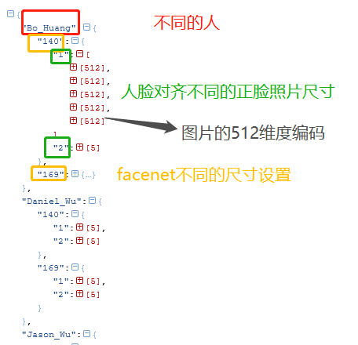

python程序

```python
#!/usr/bin/env python
# author:AnFany
# datetime:2020/12/30 14:38

# 对数据库中的人脸进行编码并存为jason文件
# facenet是基于tensorflow1.x版本的

import tensorflow.compat.v1 as tf
tf.disable_v2_behavior()

import facenet.src.facenet as facenet
import cv2
import numpy as np
import os
import json

# 人脸图片文件夹
FaceFigPath = r'E:\facenet_database\face_fig'
# 存储人脸图片编码json字符串的路经
JsonPath = r'E:\facenet_database'

# 尺寸配置
ImageSize = [140, 169]  # 需要适合预训练模型，本文模型适合[139-170]。
# 下载好的预训练模型
PreTrainModelDir = r'E:\facenet_model\20180408-102900\20180408-102900.pb'

# 人脸数据编码函数
def get_face_db_code(inp=FaceFigPath, imlist=ImageSize, md=PreTrainModelDir, jp=JsonPath):
    face_code_dict = {}
    with tf.Graph().as_default():
        sess = tf.Session()
        with sess.as_default():
            # 下载预训练模型参数
            facenet.load_model(md)
            # 根据名称获取相应的张量
            image_input_tensor = tf.get_default_graph().get_tensor_by_name("input:0")
            embeddings_tensor = tf.get_default_graph().get_tensor_by_name("embeddings:0")
            phase_train_tensor = tf.get_default_graph().get_tensor_by_name("phase_train:0")

            # 开始遍历每个人的
            for per_fold in os.listdir(inp):
                face_code_dict[per_fold] = {}
                per_fold_path = os.path.join(inp, per_fold)
                for per_fig in os.listdir(per_fold_path):
                    per_fig_path = os.path.join(per_fold_path, per_fig)
                    # 读取图片数据，并转换通道
                    image_data = cv2.cvtColor(cv2.imread(per_fig_path), cv2.COLOR_BGR2RGB)
                    # 正脸尺寸编号
                    right_face_sign = per_fig.split('_')[0]
                    # 不同的尺寸
                    for fs in imlist:
                        if fs not in face_code_dict[per_fold]:
                            face_code_dict[per_fold][fs] = {}
                        image_data2 = cv2.resize(image_data, (fs, fs), interpolation=cv2.INTER_CUBIC)
                        # 图片数据预处理
                        image_data2 = facenet.prewhiten(image_data2)
                        # 数据增加维度
                        image_data2 = image_data2.reshape(-1,fs,fs,3)
                        # 编码数据，长度为512
                        embeddings_data = sess.run(embeddings_tensor,
                                                   feed_dict={image_input_tensor: image_data2,
                                                              phase_train_tensor: False})[0].tolist()
                        if right_face_sign in face_code_dict[per_fold][fs]:
                            face_code_dict[per_fold][fs][right_face_sign].append(embeddings_data)
                        else:
                            face_code_dict[per_fold][fs][right_face_sign] = [embeddings_data]


    # 将字典变为json
    jsonstr = json.dumps(face_code_dict)
    # 存储
    with open(r'%s/em_face_json.json' % jp, 'w') as j:
        j.write(jsonstr)

    return print('人脸图片编码json保存完毕')

get_face_db_code()
```

### 5.2.4 人脸编码距离

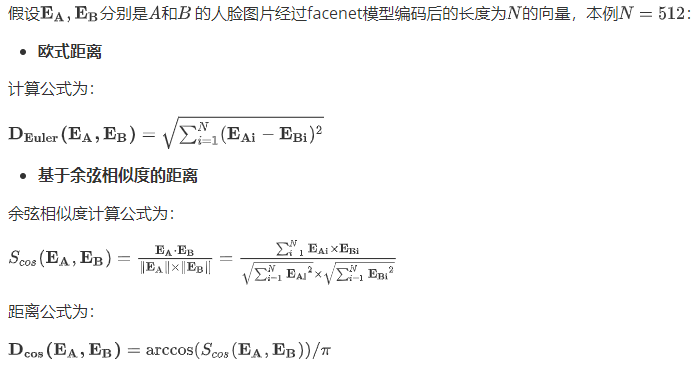

python程序为

```python
#!/usr/bin/env python
# author:AnFany
# datetime:2020/12/30 16:51

# 计算向量之间的距离

import numpy as np

def compare_dis_em(em1, em2, mode='euler'):
    em1 = np.array(em1)
    em2 = np.array(em2)
    if mode == 'euler':
        # 欧式距离
        diff = np.subtract(em1, em2)
        dist = np.sum(np.square(diff), 1)
    elif mode == 'cos':
        # 基于余弦相似度的距离
        dot = np.sum(np.multiply(em1, em2), axis=1)
        norm = np.linalg.norm(em1, axis=1) * np.linalg.norm(em2, axis=1)
        sim = dot / norm
        dist = np.arccos(sim) / np.pi
    return dist

```

### 5.2.5 图片人脸识别

根据自定义阈值，实现图片上人脸的识别，并在图片上进行身份标注，未识别的标注"unKnown"。

```python
#!/usr/bin/env python
# author:AnFany
# datetime:2020/12/30 17:05

# 实现图片的人脸识别，并进行标注

# 第一步骤：人脸检测和对齐
from mtcnn.mtcnn import MTCNN
import cv2
import os
import numpy as np
from skimage import transform as trans
import shutil

# 第二步骤：人脸编码
import tensorflow.compat.v1 as tf
tf.disable_v2_behavior()
import facenet.src.facenet as facenet
import json

# 第三步骤：人脸识别
# 计算距离
import computer_distance_em as cde

# 待识别的人脸图片文件夹
FaceFigPath = r'C:\Users\Administrator\Desktop\mtcnn_figure\mtcnn_in'
# 输出人脸图片文件夹
OutFigPath = r'C:\Users\Administrator\Desktop\mtcnn_figure\mtcnn_out'
# 数据库人脸图片编码json字符串的路经
JsonPath = r'E:\facenet_database\em_face_json.json'

# 尺寸配置
ImageSize = 169 # 最好和数据库存储的一样
# 正脸关键点
Size_KeyPoints = {'1': [(112, 112), np.array([(38.2946, 51.6963),
                                              (73.5318, 51.6963),
                                              (56.0252, 71.7366),
                                              (41.5493, 92.3655),
                                              (70.7299, 92.3655)])]}
# 下载好的预训练模型
PreTrainModelDir = r'E:\facenet_model\20180408-102900\20180408-102900.pb'
# 阈值
Threshold = 0.5  # 距离小于阈值就视为是一个人

# 陌生人标注
Strname = 'unKnown'

KN='1'

# 图片数据标注函数
def plot_tip(figuredata, boxdata, txt, boxcolor=(220, 20, 20), boxw=2, txtcolor=(20, 220, 20)):
    # 标注人脸框
    box_data = cv2.rectangle(figuredata, boxdata[0], boxdata[1], boxcolor, boxw)
    # 添加文字
    font = cv2.FONT_HERSHEY_COMPLEX
    x, y = boxdata[0][0], boxdata[0][1]
    txt_data = cv2.putText(box_data, txt, (x, y), font, fontScale=0.6, color=txtcolor, thickness=1)
    return txt_data


# 人脸识别
def face_figure_iden(inp=FaceFigPath, oup=OutFigPath, fs=ImageSize,
                     md=PreTrainModelDir, jp=JsonPath, tn=Threshold, keyn=KN,
                     rfs=Size_KeyPoints[KN][0], dstdata=Size_KeyPoints[KN][1], sn=Strname):
    # 获取数据库编码
    with open(jp, 'r') as g:
        json_str = g.read()
    face_code_dict = dict(json.loads(json_str))
    # 人脸检测模型
    detector = MTCNN()
    # 人脸编码模型
    sess = tf.Session()
    # 下载预训练模型参数
    facenet.load_model(md)
    # 根据名称获取相应的张量
    image_input_tensor = tf.get_default_graph().get_tensor_by_name("input:0")
    embeddings_tensor = tf.get_default_graph().get_tensor_by_name("embeddings:0")
    phase_train_tensor = tf.get_default_graph().get_tensor_by_name("phase_train:0")
    # 开始遍历每个图片
    for per_fig in os.listdir(inp):
        per_fig_path = os.path.join(inp, per_fig)
        # 读取图片数据，并转换通道
        image_data = cv2.cvtColor(cv2.imread(per_fig_path), cv2.COLOR_BGR2RGB)
        result_detection = detector.detect_faces(image_data)
        # 存储识别到的人脸
        face_set_signed = {}
        # 没有识别到的人脸
        fce_set_nosign = {}
        fce_set_nosign[sn] = []
        # 判断是否检测出人脸
        if result_detection:
            # 遍历获取到的每一个脸
            for face in result_detection:
                # 获取框的像素坐标
                minx, miny, width, height = face['box']
                maxx, maxy = minx + width, miny + height
                # 将检测到的人脸图片截取下来
                face_detection_data = image_data[miny:maxy, minx:maxx, :]
                face_detection_data = cv2.cvtColor(face_detection_data, cv2.COLOR_RGB2BGR)
                # 获得五个关键点的坐标
                src_data = []
                for k in ['left_eye', 'right_eye', 'nose', 'mouth_left', 'mouth_right']:
                    src_data.append(face['keypoints'][k])
                # 计算仿射矩阵
                tform = trans.SimilarityTransform()
                res = tform.estimate(np.array(src_data), dstdata)
                M = tform.params
                # 应用仿射矩阵进行人脸对齐
                align_face_data = cv2.warpAffine(image_data.copy(), M[:2, :], rfs,
                                                 flags=cv2.INTER_CUBIC, borderValue=(255, 255, 255))
                # 进入人脸编码模型
                code_face_data = cv2.resize(align_face_data, (fs, fs), interpolation=cv2.INTER_CUBIC)
                # 图片数据预处理
                code_face_data = facenet.prewhiten(code_face_data)
                # 数据增加维度
                code_face_data = code_face_data.reshape(-1, fs, fs, 3)
                # 编码数据，长度为512
                embeddings_data = sess.run(embeddings_tensor,
                                           feed_dict={image_input_tensor: code_face_data,
                                                      phase_train_tensor: False})[0].tolist()
                # 开始遍历数据库编码
                person_dict = {}
                for person in face_code_dict:
                    code_list = face_code_dict[person][str(fs)][keyn]
                    all_dis = []
                    for pco in code_list:
                        all_dis.append(cde.compare_dis_em(embeddings_data, pco))
                    # 计算均值
                    person_dict[person] = sum(all_dis) / len(code_list)
                # 所有的均值都不小于阈值，则为陌生人，否则选择最小的作为身份
                min_dis = sorted(person_dict.items(), key=lambda s:s[1])[0]
                print(min_dis)
                if min_dis[1] > tn:
                    # 陌生人
                    fce_set_nosign[sn].append([(minx, miny), (maxx, maxy)])
                else:
                    face_set_signed[min_dis[0]] = [(minx, miny), (maxx, maxy)]
        # 开始进行标注
        image_data = cv2.cvtColor(image_data, cv2.COLOR_RGB2BGR)
        if fce_set_nosign[sn]:
            for data_f in fce_set_nosign[sn]:
                image_data = plot_tip(image_data, data_f, sn)
        if face_set_signed:
            for fkey in face_set_signed:
                image_data = plot_tip(image_data, face_set_signed[fkey], fkey)
        # 保存为图片
        cv2.imwrite(r'%s/%s.png' % (oup, per_fig), image_data, [int(cv2.IMWRITE_JPEG_QUALITY), 100])

    return print('图片人脸识别完毕')

face_figure_iden()

```

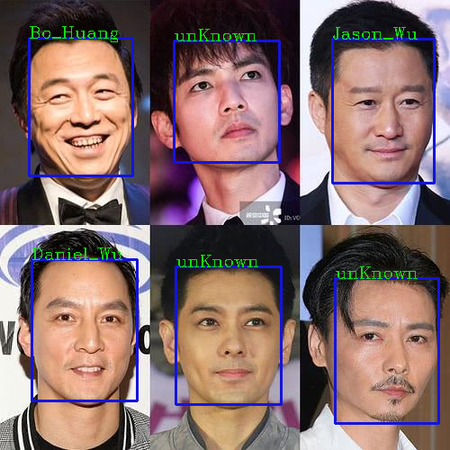


### 5.2.6 视频人脸识别

```python
#!/usr/bin/env python
# author:AnFany
# datetime:2021/1/4 9:46


# 实现在线视频的人脸检测并标注

# 第一步骤：人脸检测和对齐
from mtcnn.mtcnn import MTCNN
import cv2
import os
import numpy as np
from skimage import transform as trans
import shutil

# 第二步骤：人脸编码
import tensorflow.compat.v1 as tf
tf.disable_v2_behavior()
import facenet.src.facenet as facenet
import json

# 第三步骤：人脸识别
# 计算距离
import computer_distance_em as cde

# 数据库人脸图片编码json字符串的路经
JsonPath = r'E:\facenet_database\em_face_json.json'
# 尺寸配置
ImageSize = 169 # 最好和数据库存储的一样
# 正脸关键点
Size_KeyPoints = {'1': [(112, 112), np.array([(38.2946, 51.6963),
                                              (73.5318, 51.6963),
                                              (56.0252, 71.7366),
                                              (41.5493, 92.3655),
                                              (70.7299, 92.3655)])]}
# 下载好的预训练模型
PreTrainModelDir = r'E:\facenet_model\20180408-102900\20180408-102900.pb'
# 阈值
Threshold = 0.6  # 距离小于阈值就视为是一个人

# 陌生人标注
Strname = 'unKnown'

KN='1'

# 实时视频的输入文件
CAPVideo = cv2.VideoCapture(0, cv2.CAP_DSHOW)


# 图片数据标注函数
def plot_tip(figuredata, boxdata, txt, boxcolor=(220, 20, 20), boxw=2, txtcolor=(20, 220, 20)):
    # 标注人脸框
    box_data = cv2.rectangle(figuredata, boxdata[0], boxdata[1], boxcolor, boxw)
    # 添加文字
    font = cv2.FONT_HERSHEY_COMPLEX
    x, y = boxdata[0][0], boxdata[0][1]
    txt_data = cv2.putText(box_data, txt, (x, y), font, fontScale=0.6, color=txtcolor, thickness=1)
    return txt_data


# 视频人脸识别
def face_video_iden(fs=ImageSize,md=PreTrainModelDir, jp=JsonPath, tn=Threshold, keyn=KN,
                     rfs=Size_KeyPoints[KN][0], dstdata=Size_KeyPoints[KN][1], sn=Strname, cap=CAPVideo):
    # 获取数据库编码
    with open(jp, 'r') as g:
        json_str = g.read()
    face_code_dict = dict(json.loads(json_str))
    # 人脸检测模型
    detector = MTCNN()
    # 人脸编码模型
    sess = tf.Session()
    # 下载预训练模型参数
    facenet.load_model(md)
    # 根据名称获取相应的张量
    image_input_tensor = tf.get_default_graph().get_tensor_by_name("input:0")
    embeddings_tensor = tf.get_default_graph().get_tensor_by_name("embeddings:0")
    phase_train_tensor = tf.get_default_graph().get_tensor_by_name("phase_train:0")
    # 开始遍历每个图片
    while 1:
        ret, image_data = cap.read()
        # 读取图片数据，并转换通道
        result_detection = detector.detect_faces(image_data)
        # 存储识别到的人脸
        face_set_signed = {}
        # 没有识别到的人脸
        fce_set_nosign = {}
        fce_set_nosign[sn] = []
        # 判断是否检测出人脸
        if result_detection:
            # 遍历获取到的每一个脸
            for face in result_detection:
                # 获取框的像素坐标
                minx, miny, width, height = face['box']
                maxx, maxy = minx + width, miny + height
                # 将检测到的人脸图片截取下来
                face_detection_data = image_data[miny:maxy, minx:maxx, :]
                face_detection_data = cv2.cvtColor(face_detection_data, cv2.COLOR_RGB2BGR)
                # 获得五个关键点的坐标
                src_data = []
                for k in ['left_eye', 'right_eye', 'nose', 'mouth_left', 'mouth_right']:
                    src_data.append(face['keypoints'][k])
                # 计算仿射矩阵
                tform = trans.SimilarityTransform()
                res = tform.estimate(np.array(src_data), dstdata)
                M = tform.params
                # 应用仿射矩阵进行人脸对齐
                align_face_data = cv2.warpAffine(image_data.copy(), M[:2, :], rfs,
                                                 flags=cv2.INTER_CUBIC, borderValue=(255, 255, 255))
                # 进入人脸编码模型
                code_face_data = cv2.resize(align_face_data, (fs, fs), interpolation=cv2.INTER_CUBIC)
                # 图片数据预处理
                code_face_data = facenet.prewhiten(code_face_data)
                # 数据增加维度
                code_face_data = code_face_data.reshape(-1, fs, fs, 3)
                # 编码数据，长度为512
                embeddings_data = sess.run(embeddings_tensor,
                                           feed_dict={image_input_tensor: code_face_data,
                                                      phase_train_tensor: False})[0].tolist()
                # 开始遍历数据库编码
                person_dict = {}
                for person in face_code_dict:
                    code_list = face_code_dict[person][str(fs)][keyn]
                    all_dis = []
                    for pco in code_list:
                        all_dis.append(cde.compare_dis_em(embeddings_data, pco))
                    # 计算均值
                    person_dict[person] = sum(all_dis) / len(code_list)
                # 所有的均值都不小于阈值，则为陌生人，否则选择最小的作为身份
                min_dis = sorted(person_dict.items(), key=lambda s:s[1])[0]
                print(min_dis)
                if min_dis[1] > tn:
                    # 陌生人
                    fce_set_nosign[sn].append([(minx, miny), (maxx, maxy)])
                else:
                    face_set_signed[min_dis[0]] = [(minx, miny), (maxx, maxy)]
        # 开始进行标注
        image_data = cv2.cvtColor(image_data, cv2.COLOR_RGB2BGR)
        if fce_set_nosign[sn]:
            for data_f in fce_set_nosign[sn]:
                image_data = plot_tip(image_data, data_f, sn)
        if face_set_signed:
            for fkey in face_set_signed:
                image_data = plot_tip(image_data, face_set_signed[fkey], fkey)
        # 保存为图片
        image_data = cv2.cvtColor(image_data, cv2.COLOR_RGB2BGR)
        cv2.imshow('object detection', image_data)
        if cv2.waitKey(25) & 0xFF == ord('q'):
            cv2.destroyAllWindows()
            break
    cap.release()
    cv2.destroyAllWindows()


face_video_iden()

```

示图：

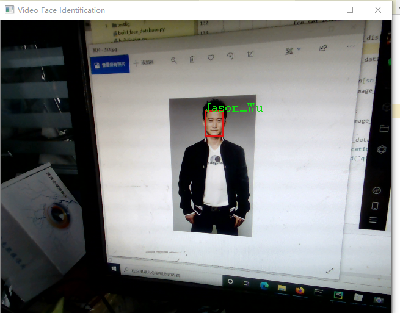

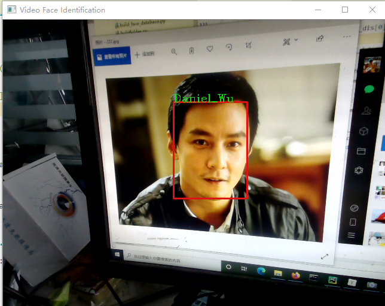

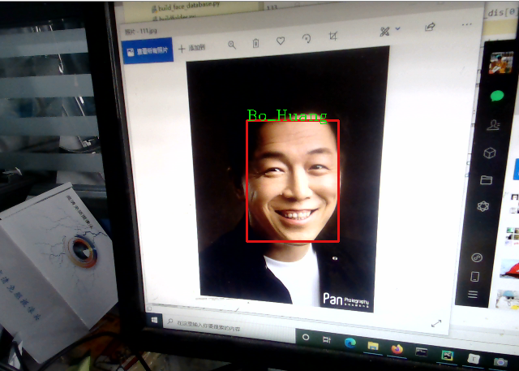

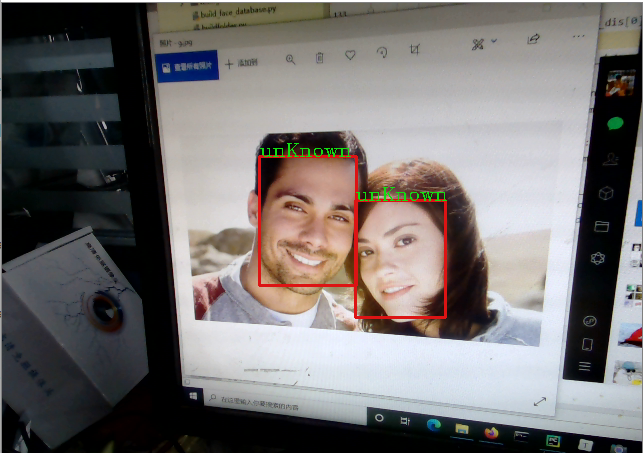